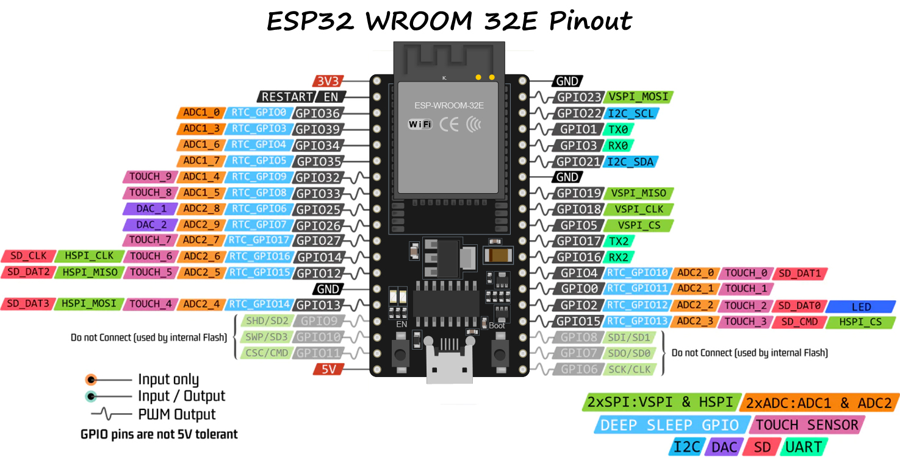
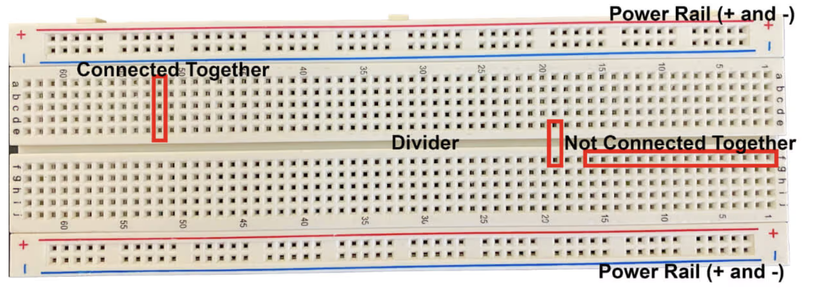
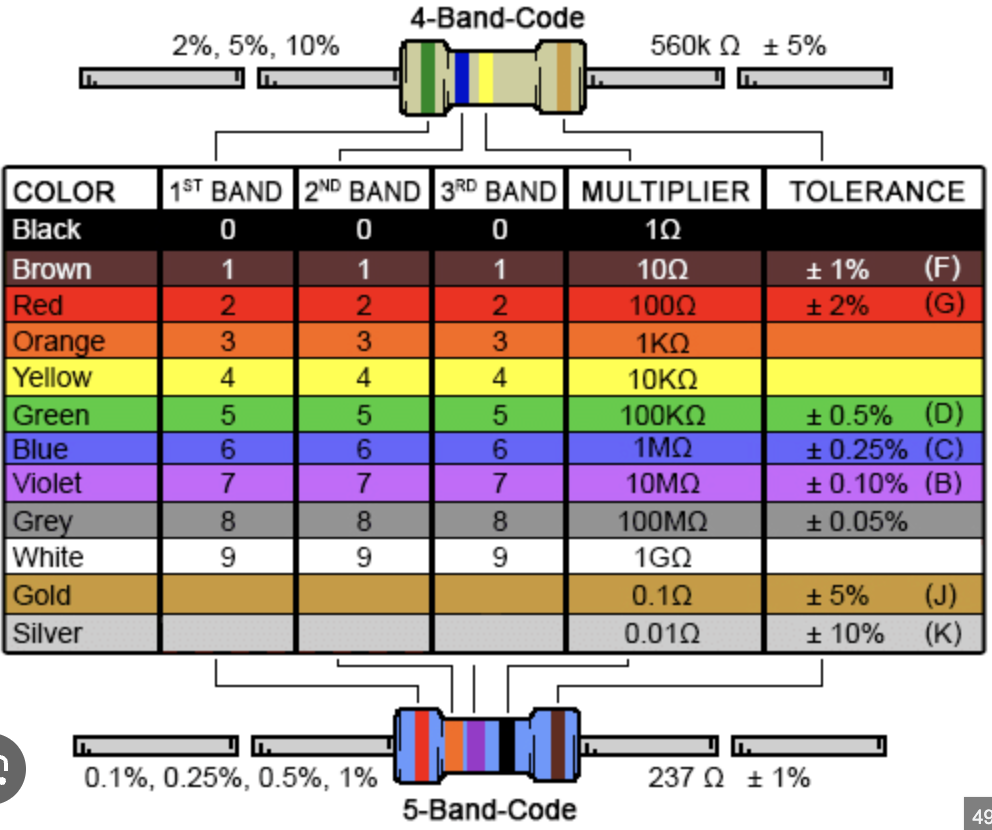

# Week 1: Environment Setup & GPIO Basics

## Overview
Welcome to BEEP! This first week focuses on getting comfortable with the embedded development environment and understanding the most fundamental concept in embedded systems: **General Purpose Input/Output (GPIO)**.

You will learn how to control the physical world using code (Blinking an LED) and how to read information from the world (Reading a button).

## Step 0: Environment Setup

*Ryan fill in prease*

## Step 1: Hardware Setup



For this lab and all future labs, we will be using the **ESP32 WROOM32E** devkit. This is a small, low-cost development board that is perfect for embedded development. It has a built-in debugger and is easy to use. The devkit is a breadboard-friendly board, making it easy to connect components.

### 1.1 Breadboard Setup



Breadboards are used to connect components without soldering. They are a great way to test and debug your circuit before solififying a design. Pins are connected horizontally, and components are connected vertically (this is flipped in the diagram above). The breadboard pictured here should be similar to the one provided in your kit. 

The red and blue lines on the breadboard are power rails, which can be used to power other components. The each pin in a power rail is connected to *all* other pins in the same rail.

### 1.2 Power

When programming your ESP32, you will need to connect it to your computer via a USB cable. This cable will also supply power to your microcontroller. Some of the pins on the ESP32 are channel the voltage from the USB cable to your breadboard, which can be used to power other components. 

By convention, we will connect a 3.3V pin to our positive (red) power rail, and a GND pin to our negative (blue) power rail. Go ahead and wire these together now, while referencing the pinout diagram above.

### 1.3 LEDs




An LED (Light Emitting Diode) is a component that emits light when an electric current flows through it. LEDs are polarized, meaning they have a positive and negative terminal, and can only emit light when the current flows in the correct direction. The longer leg of the LED is the anode, and the shorter leg is the cathode. 

LEDs also almost always need a current-limiting resistor to limit the current flowing through them. This is to prevent the LED from burning out. The ESP32 has a built-in current-limiting resistor for each GPIO pin, but it is not always sufficient for LEDs. So, also look for a 100 ohm resistor in your kit, and use it to limit the current flowing through the LED.

Now, we can wire the LED to the breadboard. We will use GPIO27 to control this LED, so connect the longer leg of the LED to GPIO27, and the shorter leg to GND. But, don't forget to add the current-limiting resistor in series with the LED too. 

### 1.4 Buttons


Buttons are a common input device used to control microcontrollers. They are simple to use, and can be used to control a wide range of applications. 

Wiring a button is different from wiring an LED, but the concept is the same. Our button has 4 terminals, but we will only be using two of them. When pressed, the button connects its two sides together.

Place the button over the divider on the breadboard, and connect two *unconnected* sides to GPIO26 and GND respectively. The other two sides can be left unconnected.

## Step 2: Writing Software

Now that we have our hardware set up, we can write some software to control it. Open `main/main.c` in your editor. This is where we will write our C code.

We want to build a program that reads the state of the button, and if it is held down, flashes the LED.

### 2.0 Concept: GPIO Configuration

Before writing code, it's important to understand *why* we configure pins.

**1. GPIO Modes (Input vs Output)**
Microcontroller pins are flexible; they can be Inputs, Outputs, or various other special functions. By default, they are often disconnected (high impedance) to protect the chip.
*   **Output Mode**: The chip connects the pin to its internal voltage driver. This allows the code to forcefully drive the pin to 3.3V (High) or 0V (Low), which is needed to power an LED.
*   **Input Mode**: The chip disconnects the driver and connects a voltage sensor. This allows the code to "read" if the voltage at the pin is High or Low, which is effective for reading a button.

**2. Pull Modes (Pull-Up vs Pull-Down)**
When a button is *not* pressed, it is just an open wire. The pin is effectively connected to nothing. This is called a "floating" state, where the pin can randomly read High or Low due to static electricity or interference.
*   **Pull-Up**: Connects the pin to 3.3V through a weak internal resistor. So, when the button is open, the pin reads **High (1)** (default state). When you press the button (connecting it to GND), the direct connection to ground overpowers the weak resistor, and the pin reads **Low (0)**.
*   **Pull-Down**: Connects the pin to GND through a weak resistor. Default is Low, Pressing button (connected to 3.3V) makes it High.
*   *Note: In our circuit, we connected the button to GND. So we MUST use a Pull-Up resistor to ensure it stays High when not pressed.*

### 2.1 Includes and Defines

First, we need to include the necessary libraries and define our pin mappings. Add the following to the top of `main.c`:

```c
#include "driver/gpio.h"
#include "rom/ets_sys.h"

#define LED_PIN 27
#define BUTTON_PIN 26
```

**Explanation:**
- `#include "driver/gpio.h"`: Gives us access to the ESP32's GPIO (General Purpose Input/Output) driver, so we can check buttons and turn on LEDs.
- `#include "rom/ets_sys.h"`: Provides system helper functions, specifically for creating delays (`ets_delay_us`).
- `#define`: These assign human-readable names to our pin numbers (27 and 26), making the code easier to understand and update.

### 2.2 Main Function Loop

In embedded C, the `app_main` function is the entry point. A typical firmware program initializes peripherals (like pins) once, and then enters an infinite `while(1)` loop to continuously process data.

Copy the following template into your file, replacing the existing `app_main`:

```c
void app_main(void) {
    // -------------------------
    // 1. PIN CONFIGURATION
    // -------------------------
    // TODO: Configure your LED and Button pins here
    // Hint: Use gpio_reset_pin(), gpio_set_direction(), and gpio_set_pull_mode()


    int led_state = 0;

    // -------------------------
    // 2. MAIN LOOP
    // -------------------------
    while (1) {
        // TODO: Read the button state
        // Hint: use gpio_get_level(PIN_NUMBER) to get a 0 or 1

        // TODO: If button is pressed (remember input is pulled UP, so pressed == 0)
        //       Then toggle the LED state, write it to the LED pin, and wait a bit.
        
        // Hint: use gpio_set_level(PIN, LEVEL) and ets_delay_us(MICROSECONDS)
    }
}
```

**Explanation:**
- **Pin Configuration**: Before the loop, we must tell the ESP32 which pins are Inputs (Button) and which are Outputs (LED).
- **Infinite Loop**: The `while(1)` ensures our program never stops. It constantly checks the button thousands of times per second.

### 2.3 Implementation Tasks

Use the TODO comments above to finish the code. Here is what you need to achieve:

1.  **Configure LED**: Reset the `LED_PIN` and set its direction to `GPIO_MODE_OUTPUT`.
2.  **Configure Button**: Reset the `BUTTON_PIN`, set its direction to `GPIO_MODE_INPUT`, and enable the internal pull-up resistor with `gpio_set_pull_mode` using `GPIO_PULLUP_ONLY`.
3.  **The Logic**:
    - Inside the loop, read the button.
    - If the button value is `0` (Pressed), flip `led_state` (if it was 0 make it 1, if 1 make it 0).
    - Write the new `led_state` to the `LED_PIN`.
    - Delay for 1 second (1,000,000 microseconds) so you can see the flash.

### 2.4 References

For more information on the functions used in this lab, check out the official ESP-IDF documentation:
*   [ESP-IDF GPIO API Reference](https://docs.espressif.com/projects/esp-idf/en/latest/esp32/api-reference/peripherals/gpio.html)
