# Week 1 - Embedded Basics

## Overview
Welcome to BEEP! This first week focuses on getting comfortable with the embedded development environment and understanding the most fundamental concept in embedded systems: **General Purpose Input/Output (GPIO)**.

You will learn how to control the physical world using code (blinking an LED) and how to gather information from the world (reading a button).

## 1.1 Hardware


For this and all future activities, we will be using the **Sunfounder ESP32 Starter Kit**. [Here](https://docs.sunfounder.com/projects/esp32-starter-kit/en/latest/components/component_list.html) you can see the full component list as well as documentation for each included item. These activities will all start with hardware assembly, which requires that you understand how to read [KiCAD](https://www.kicad.org/) diagrams as well as find the correct components in your kit.  

If you're unfamiliar with KiCAD, there's a great introduction video [here](https://www.youtube.com/watch?v=vLnu21fS22s&list=PLUOaI24LpvQPls1Ru_qECJrENwzD7XImd). You shouldn't need more than the first video for the activities we will be doing (it walks through *creating* a schematic which is useful for learning how they work, but you will not be asked to create any of your own)

### 1.1.1 Breadboards


Breadboards are used to connect components without soldering. They are a great way to test and debug your circuit before solidifying a design. The pins are connected by numbered row with the exception of the power rails, which are connected to all of the other pins in their column rail. The + and - power rails are used to power external components, and it very important that you ***never*** connect them together directly, as this causes a short-circuit and damages equipment.

### 1.1.2 USB and Power

When programming your ESP32, you will need to connect it to your computer via a USB cable. This connection allows you to upload your code, send and receive data (like print statements), and provides power to the breakout board. There are 3 types of pins (5V, 3.3V, and GND) that supply power from the USB cable to your breadboard and the external components on it. 

By convention, we will connect a 3.3V (**OR** 5V, but not both) pin to our positive (red) power rail, and a GND pin to our negative (blue) power rail. 

### 1.1.3 LEDs

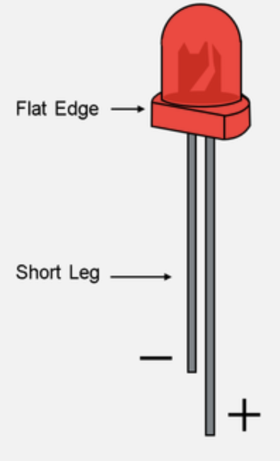


An LED (Light Emitting Diode) emits light when an electric current flows through it. LEDs are polarized, meaning they have a positive (anode) and negative (cathode) terminal, and can only emit light when current flows from the anode to the cathode. 

LEDs almost always need a current-limiting resistor to prevent burn-out, as they cannot handle as much as the microcontroller's pins can provide. The ESP32 has a built-in current-limiting resistor for each GPIO pin, but it is not always sufficient for LEDs. Any resistor from ~100-300 Ohms will work just fine.

### 1.1.4 Buttons

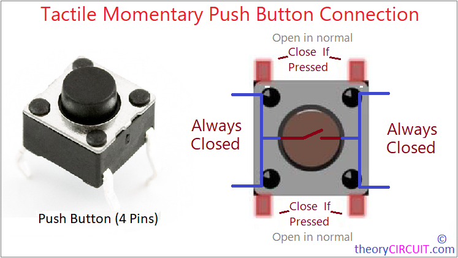

Buttons are a common input device used in embedded circuits. They are simple to use, and can be used in a wide range of applications. Typical buttons like the one shown above, are SPST (single pole, single throw) switches, which means that there is **one** switch that connects **two** pins. The pin pairs on each side of the button are electrically connected, the duplicates are only present for mechanical stability. 

Most button circuits involve one pin connected to a GPIO pin and the other connected to ground, registering low when the button is pressed. This configuration requires a **pull-up** resistor on the GPIO pin side of the button. This ensures that the pin's value is tied high, until the button press shorts the pin to ground, pulling it low.

### 1.1.5 Circuit Setup

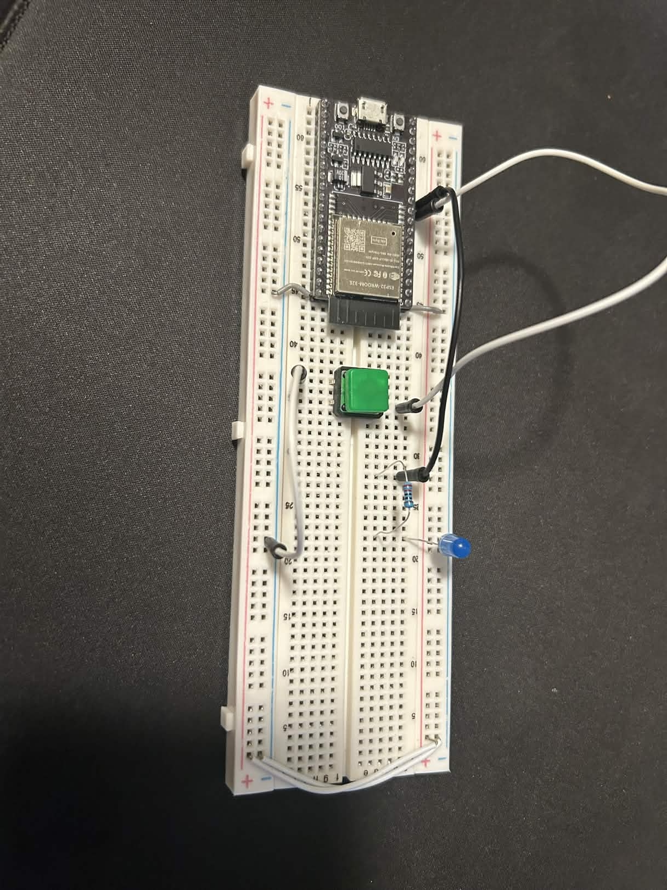

This week's circuit is simple, press the button and the light turns on, release it and it turns off again! As shown in the diagram, connect GPIO pin 27 to the LED's anode and the LED's cathode to ground. The 220 Ohm resistor can go on either side of the LED, as long as it is placed **in-series**. The button should have one side connected to GPIO pin 26 and the other to ground.

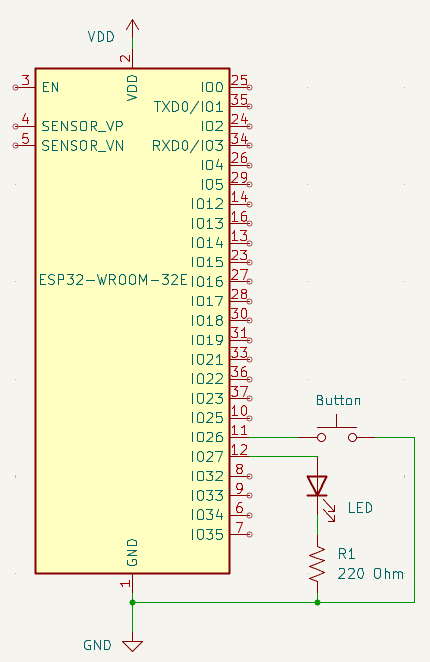


## 1.2 Environment Setup

We have chosen the *ESP-IDF* as the development environment for BEEP. To get started you must have [Visual Studio Code](https://code.visualstudio.com/download) downloaded. Click on the link and download the appropriate version for your OS if you don't have it already. The next step is downloading the *ESP-IDF* extension, which requires the following steps: 
1. Open VScode (*do not open a folder yet*), navigate to the **Extensions** tab on the sidebar, and search *ESP-IDF*. Install the one highlighted in this screenshot:    
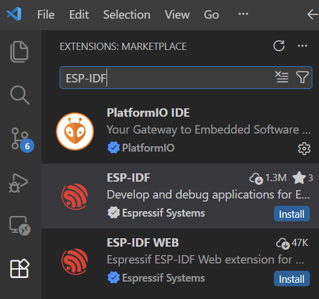

2. Click the **ESP-IDF: Explorer** button in the Extensions tab, open the **advanced** dropdown and click on **Open ESP-IDF Installation Manager**.   
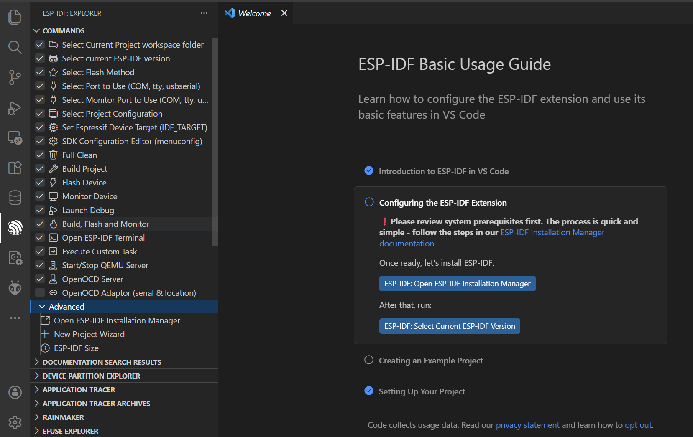
3. You may be prompted to select a mirror. If so, select **github**.   
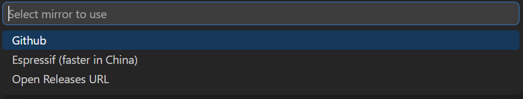

4. Now the **EIM** (Espressif Installtion Manager) should open, at which point you should click **Start Installation**.   
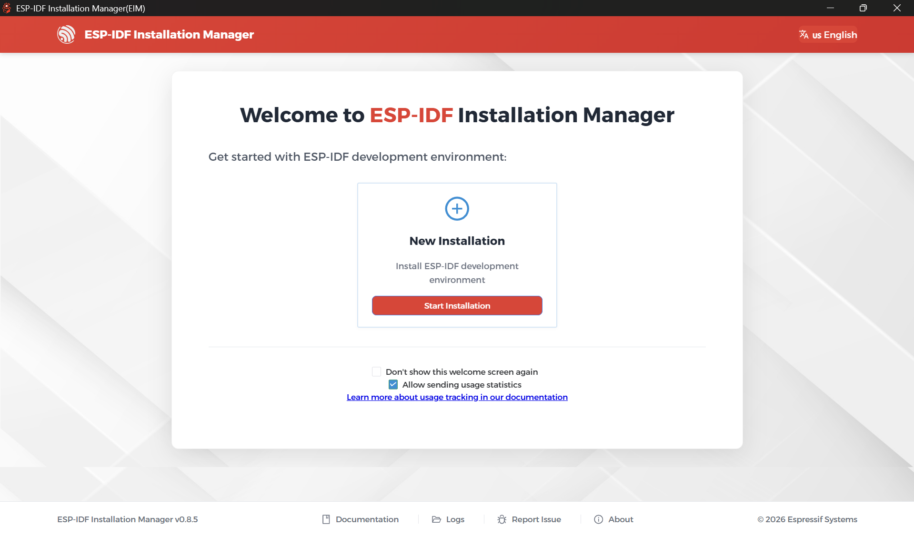

5. Select **Easy Installation**   
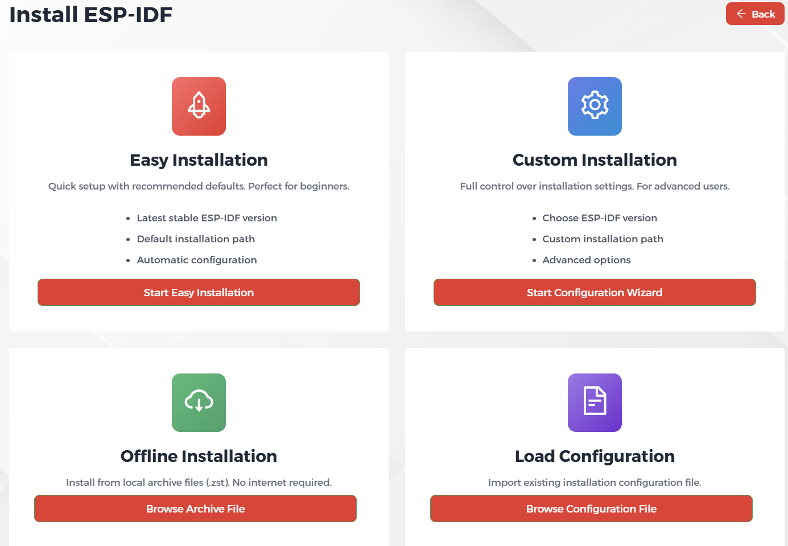

6. Then click **Start Installation** again and wait for the installation to finish.   
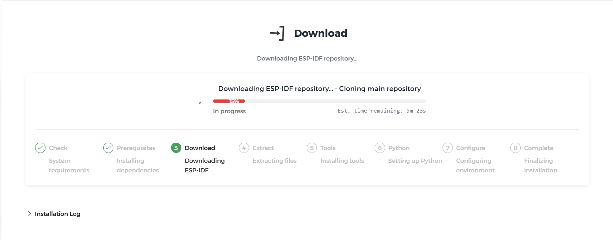

Once you have the extension installed, you should setup a parent folder to hold the individual week folders you'll be creating. For windows users we suggest placing it in your `C:\Users\{your username}` folder. This is not a requirement though, as long as you don't have any spaces in the filepath it will work. **DO NOT** place the parent folder inside of OneDrive as the filepath spaces will break the build system, if your windows/mac username has spaces in it come find one of the BEEP leaders and we will assist you. Now, open VSCode and do the following:

1. Press ```ctrl+shift+p``` to open up the VSCode command panel at the top of your screen
2. Search for ```ESP-IDF: Create New Empty Project```


3. Enter a folder name in the popup window (entirely up to you)


4. Select a location for the new folder, which should be inside the parent folder you created earlier.

5. Open your new project folder in VSCode and replace the  ```main``` folder with the template main folder provided in this week's github repository.

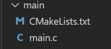

## 1.3 Software

Now that you have your hardware and environment ready, you're almost ready to write some software! Open `main/main.c` in your editor. If you copied in the `main` folder from this week's github repository, you should see this:  
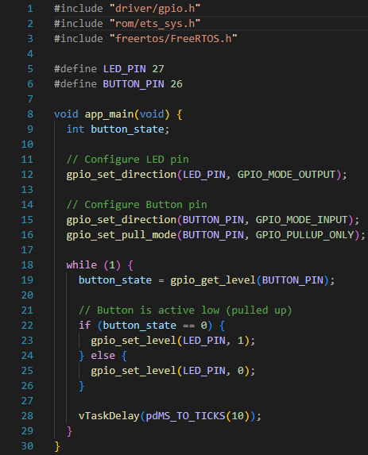

Those top 3 lines are the `include` statements. These are how you reference code written in other files, and are critical to all embedded systems development. The three files included are all part of the **ESP-IDF**. IDF stands for **IoT Development Framework**, keyword **framework**. This means that the IDF provides some code for interacting with the microcontroller's internal hardware out-of-the-box, which you will use often.

Directly following the includes are **macro** definitions. These are program-wide constants that represent some value. In this case, they represent the integers corresponding to the GPIO pins you connected your components to. At compile time, the compiler replaces every instance of these macros with the value it is defined as. These are meant to make your code easier to read, and they are used heavily in the IDF. 

Next, `app_main`. You will write many functions in these activities, but IDF programs always start execution here. Code in `app_main` will generally follow the same structure: some one-time setup code followed by an infinite loop. All of the `gpio` functions you see are declared in `driver/gpio.h`. You'll be using lots of these **SDK** (software development kit) functions from the IDF, but they usually won't be filled in like shown above. 

In order to find and/or fill in these functions you'll need one of two things, the [SDK Docs](https://docs.espressif.com/projects/esp-idf/en/stable/esp32/api-reference/index.html) or VScode **Intellisense**. Intellisense allows you to `ctrl` click on a header file include statement (or any code declared in a header file, whether it be a macro, function, data type, etc.) to open the header file and peek at its contents. As you can imagine, this is much quicker than reading through the online documentation. However, it isn't supported by default, you'll need to complete these 3 steps in order to get it working.

1. Download the C/C++ VSCode Extension (also useful for other things)  
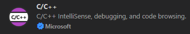

2. Press `ctrl + shift + p` to open the VSCode command terminal again, and run **Add VS Code Configuration Folder**.


3. Navigate to the ESP-IDF Extension in the sidebar, and press `Build Project`. This may take a while the first time you build every week, after it completes your project should like this (now with build folder!):  
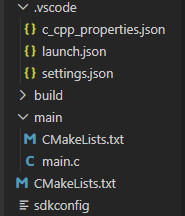

This leads right into the next topic, the **build system**. Another part of the IDF, it handles compiling your code into raw binaries, uploading to the microcontroller, and communicating with the microcontroller during code execution. These are the commands you are provided with by the IDF:

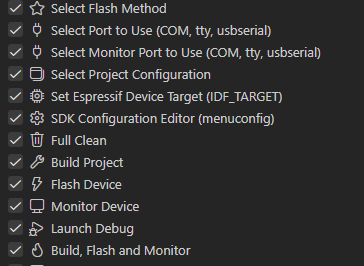

The 3 you will use the most are `Build Project` which compiles your code from C to binary, `Flash Device` which uploads the binary file to the microcontroller's memory, and `Monitor Device` which opens up a terminal where you can view print statements from the microcontroller. Monitoring (while helpful) isn't strictly necessary, but building and flashing must be done every time you change your code and wish to test the newer version. Some other important commands:

* `Select Flash Method` Selects how the IDF communicates with your microcontroller to upload code, run this and select **UART** every time you start a new project.

* `Select Port to Use` and `Select Monitor Port to Use` These choose the USB port to connect to your microcontroller on. You will also have to run these once every time you start a new project. After clicking them you should be prompted with a popup like this:  
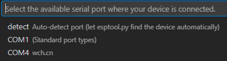  
Always select the port with the unique manfufacturer ID next to it, `wch.cn` in this case. If you don't see any **COM** ports available or the ones that are don't work when you try to flash device, there may be several issues.  
    1. Bad USB cable or laptop USB port
    2. Cable or port is power-delivery only
    3. Missing/incorrect drivers (if you're on Windows)  
    
    The first fix attempt should always be swapping USB ports/cables (this is a very common issue!). If that doesn't solve it, go to [this link](https://www.silabs.com/software-and-tools/usb-to-uart-bridge-vcp-drivers?tab=downloads) and download the latest **CP210x Universal Windows Driver**. Once you unzip the folder, open **Device Manager** and install the driver:  
    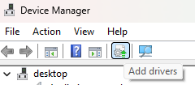  
    Restart VSCode and this should solve the issue.

* `Full Clean` deletes the build folder, useful for doing a *turn if off and on again* debug strategy, sometimes resolves strange errors.

You shouldn't need the rest of the IDF commands, but if you're curious come ask a BEEP mentor we'd be happy to explain!

If you're able to build and flash your microcontroller, you should see the LED turn on when you press the button and then off when you release it. That's it for this week, come back next week to learn about **MCU Architecture, Debouncing, and Program State**!