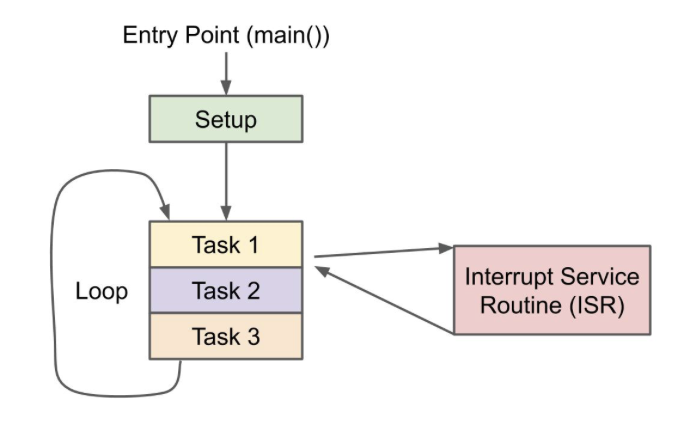
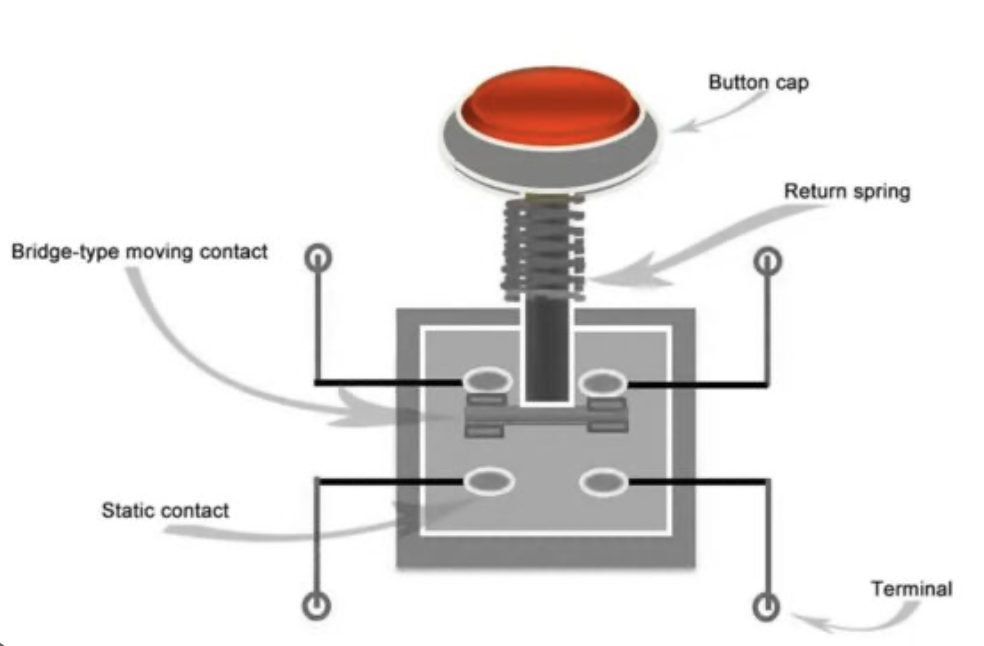
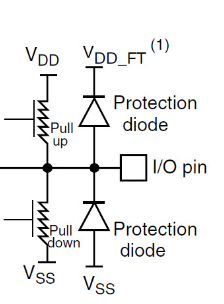
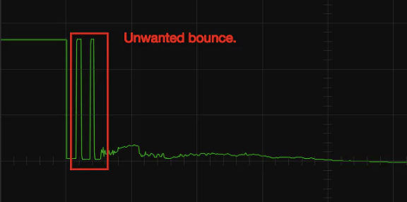

# BEEP WEEK 2 README
---

This week we will be designing a house alarm system. The alarm will properly handle code entering and system mode updates through physical button presses and indicate to the user the current status through LED indicators. All components are included in your BEEP kits.


---

## 2.1 Content Overview
### 2.1.1 Polling vs Event-Driven Program Design
Most embedded firmware applications can be broken down into two main types: **polling** and **event-driven**.

As many of you have probably tinkered with Arduino before, we will use that as an example to understand a **polling design**. In polling, the main idea is that the processor will constantly run through a super-loop of code after an initial setup. This works for rather simple programs that follow a consistent program flow, but when complexity increases and demands on both timing and required compute increase, this approach is not sufficient.


As mentioned before, when program complexity grows, polling designs usually can't meet the demand. This is due to the fact that the CPU, in a polling program, cannot context switch. Context switching is when the CPU saves it previous state, jumps to a new piece of code/function, and returns back to the previous save-state when it has finished the code/function. This allows for the CPU to be **interrupted** and dragged away from the main super-loop. 

Context switching is super useful and builds the premiss of **event-driven** design. The ability to context switch and save CPU state allows the CPU to handle things in real-time rather than waiting for it to be processed in a super loop. This means that the CPU can still run a super loop and jump away to handle an event. An event can be anything and is user defined, but some good examples are: button presses, timers, UART/SPI/I2C errors, etc. The logistics of implementing context switching will be handled in week 3, but it is important to start thinking about the use cases and benefit it offers.



---

### 2.1.2 Mechanical Switches
Understanding the inner workings of mechanical switches is important as it allows for us as engineers to interface the real-world through button presses! Buttons and switches are everywhere from microwaves to toothbrushes. Not only are they everywhere, but they are also dead easy to understand. We will be focussing on buttons but its important to note how many different kinds of switches there are:


Back to buttons, they come in all different shapes, sizes, colors, tactile feel, etc., but for the most part all mechanical buttons operate with the same scheme. There are usually four contacts oriented in square around the button. From the image below, the top two contacts are connected together and the bottom two are connected. When the button is pressed, a spring is compressed, and the moving contact bridges the top two contacts to the button two contacts.



These buttons can then be easily interfaced with VDD (Logic HIGH ~3V) and GND (Logic LOW ~0V) to allow for simple MCU interfacing. An important concept when interfacing buttons or dealing with inputs in general is **Pull-up & Pull-down** networks.



These networks allow the I/O pin to constantly have a defined logical value. When the button isn't pressed this will leave the I/O pin floating (undefined) resulting in garbage state (HIGH/LOW) readings. To combat this, pull-up/pull-down resistors are implemented as the image above shows. This [video](https://www.youtube.com/watch?v=5vnW4U5Vj0k) will help develop some more intuition/understanding on the topic.

---

### 2.1.3 Software & Hardware Debouncing
Now that you know how to interface a button, an important step is making the signal you read from the button clean! A clean signal is on that is free from noise. Below is a noisy button press, otherwise known as bouncing.



Now that you know how to interface a button, an important step is making the signal you read from the button clean. A clean signal is one that is free from noise. Below is an example of a noisy button press, otherwise known as bouncing.

When a mechanical button is pressed or released, the internal contacts do not immediately settle into a stable state. Instead, they rapidly make and break contact for a short period of time, typically on the order of a few milliseconds. To a microcontroller, this bouncing can appear as multiple button presses, leading to unintended behavior in your program.

**Hardware Debouncing**
One common hardware-based solution is the use of a low-pass RC filter. By placing a resistor and capacitor in series with the button, rapid voltage changes caused by bouncing are smoothed out before reaching the MCU input pin.

The capacitor charges and discharges slowly relative to the bounce duration, effectively filtering out short, unwanted transitions. Hardware debouncing has the advantage of reducing noise before the signal ever reaches the microcontroller, but it requires additional components and reduces flexibility.

**Software Debouncing**
Software debouncing is often preferred in embedded systems due to its flexibility and minimal hardware requirements. In software debouncing, the firmware waits for the button signal to remain stable for a fixed amount of time before considering it a valid press.

A common approach is:
	1.	Detect a change in button state
	2.	Wait a short delay (e.g., 10–50 ms)
	3.	Re-read the button state
	4.	Confirm the press only if the state is unchanged

This method ensures that transient noise does not trigger false events. Software debouncing is easy to tune and can be implemented using timers, counters, or RTOS delays.

### 2.1.4 State Based Programs & FSM Diagrams
A state represents a well-defined mode of operation for the system. At any given time, the system exists in exactly one state and behaves according to the rules of that state. Transitions between states occur in response to events, such as button presses, timers expiring, or sensor thresholds being crossed. This model naturally complements event-driven program design, as discussed earlier.

For example, a simple house alarm system may include states such as:
- DISARMED
- ARMED
- ALARM_TRIGGERED
- CODE_ENTRY

Each of these states defines what the system should do with inputs and outputs. For instance, LED indicators may change color depending on the current state, and button presses may have different meanings depending on which state the system is in.

A Finite State Machine (FSM) diagram is a visual representation of this behavior. States are typically drawn as circles, while transitions are drawn as arrows labeled with the event that causes the transition. FSM diagrams allow engineers to reason about system behavior before writing any code, helping to catch logical errors early and making the program easier to debug and extend.

In firmware, FSMs are often implemented using:
- Enumerated types to represent states
- A variable that tracks the current state
- Event handlers or conditional logic that perform state transitions

By organizing your alarm system as a finite state machine, you ensure that system behavior is predictable, scalable, and easy to reason about. This approach is especially valuable in embedded systems where incorrect state transitions can lead to unsafe or unintended behavior.

In this lab, you will design and implement an FSM that controls the alarm system’s operation, handles user input through button presses, and updates LED indicators to reflect the current system state.

---

## 2.2 Lab Walkthrough

The firmware implements a state-based alarm system using GPIO inputs, debounced button presses, and LED indicators. The system supports:
- Arming the alarm
- Disarming the alarm using a binary passcode
- Programming a new passcode
- Visual system feedback using LEDs

---

### 2.2.1 Included Libraries

```
#include <stdio.h>
#include "freertos/FreeRTOS.h"
#include "freertos/task.h"
#include "esp_log.h"
#include "esp_timer.h"
#include "driver/gpio.h"
```

These libraries provide:
- FreeRTOS task support and delays
- ESP-IDF logging utilities
- High-resolution microsecond timing
- GPIO input and output drivers

---

### 2.2.2 Pin Definitions and Timing Constants

LED Output Pins
```
#define GREEN_LED_PIN 27
#define RED_LED_PIN 14
#define BLUE_LED_PIN 12
```

- Green LED indicates the system is disarmed
- Red LED indicates the system is armed or flashing during an alarm
- Blue LED indicates passcode programming mode

---

Button Input Pins
```
#define ARM_PIN 18
#define DISARM_PIN 19
#define CODE0_PIN 21
#define CODE1_PIN 22
#define SETCODE_PIN 23
```

- ARM arms the alarm system
- DISARM attempts to disarm the system
- CODE0 / CODE1 are used for binary code entry
- SETCODE enters and exits code programming mode

---

Timing Definitions

#define DEBOUNCE 250 * 1000
#define ALARM_PERIOD 200 * 1000

- DEBOUNCE defines a 250 ms debounce window
- ALARM_PERIOD defines the flashing period of the alarm LED

All timing values are expressed in microseconds, matching esp_timer_get_time().

---

### 2.2.3 GPIO Configuration Structures

Input Pin Configuration

```
gpio_config_t input_pin = {
    .pin_bit_mask = 
    .mode = 
    .pull_up_en = 
    .pull_down_en = 
    .intr_type = 
};
```

- All buttons should be configured as inputs
- Internal pull-up resistors should be enabled
- Buttons should be active-low
- GPIO interrupts should be disabled

---

Output Pin Configuration

```
gpio_config_t output_pin = {
    .pin_bit_mask = 
    .mode = 
    .pull_up_en = 
    .pull_down_en = 
    .intr_type = 
};
```

- Configures all LED pins as digital outputs
- Pullup and pulldown circuits should be disabled
- Interrupts should be disabled

---

### 2.2.4 Global State Variables
```
bool alarm_triggered = false;
bool alarm_flash = false;
bool alarm_armed = false;
bool setting_code = false;
```

These variables track the current operational state of the alarm system.

---

Passcode Storage Variables
```
uint8_t code = 0b00000000;
uint8_t temp_code = 0b00000000;
uint8_t guess_code = 0b00000000;
```

- code stores the programmed passcode
- temp_code stores bits while programming a new code
- guess_code stores bits entered during a disarm attempt

---

### 2.2.5 Debounce Timing Variabless
```
intmax_t previous_alarm_beep = 0;
intmax_t previous_arm_press = 0;
intmax_t previous_disarm_press = 0;
intmax_t previous_setcode_press = 0;
intmax_t previous_code1_press = 0;
intmax_t previous_code0_press = 0;
```

Each button maintains an independent timestamp, allowing all inputs to be debounced separately.

---

### 2.2.6 Helper Functions

```
void print_code(uint8_t val, const char* msg) {
    ESP_LOGI(TAG, "%s: %c%c%c%c%c%c%c%c", msg,
        val & 0x80 ? '1' : '0',
        val & 0x40 ? '1' : '0',
        val & 0x20 ? '1' : '0',
        val & 0x10 ? '1' : '0',
        val & 0x08 ? '1' : '0',
        val & 0x04 ? '1' : '0',
        val & 0x02 ? '1' : '0',
        val & 0x01 ? '1' : '0');
}
```

Prints an 8-bit value to the serial console in binary format.
This function is used for debugging passcode entry and verification.

---

```
bool debounce_check(intmax_t* last_press) {
    //get current time
    if (/*elapsed time*/ > DEBOUNCE) {
        last press = current time
        return true
    }
    return false
}
```

Checks whether enough time has elapsed since the last button press.

Function behavior:
- Reads the current time using esp_timer_get_time()
- Compares it against the last recorded press time
- Returns true only if the debounce interval has elapsed

This function prevents false triggers due to mechanical switch bounce.

---

### 2.2.7 Alarm Control Functions

```
void handle_arm_disarm(void) {
    ** YOUR IMPLEMENTATION HERE
}
```


Handles all arming and disarming behavior.

Arming Conditions:
- Alarm is not already armed
- System is not in code-setting mode
- ARM button is pressed
- Debounce check passes

When these conditions are met, the system arms and clears any previous guess code.

Disarming Conditions:
- Alarm is currently armed
- DISARM button is pressed

If the entered guess code matches the stored passcode:
- The system disarms
- The alarm trigger is cleared

If the code does not match:
- The alarm is triggered

---
```
void handle_set_code(void)  {
    ** YOUR IMPLEMENTATION HERE
}
```

Handles passcode programming.

First SETCODE press:
- Enters code-setting mode
- Clears the temporary code buffer

Code entry:
- CODE0 shifts a 0 into temp_code
- CODE1 shifts a 1 into temp_code

Second SETCODE press:
- Saves the temporary code to code
- Exits code-setting mode

---
```
void handle_guess_code(void) {
    ** YOUR IMPLEMENTATION HERE
}
```

Handles passcode entry when the alarm is armed.
- Returns immediately if the alarm is disarmed
- CODE0 and CODE1 shift bits into guess_code
- The resulting code is checked when DISARM is pressed

---

### 2.2.8 LED Update Logic
```
void update_leds(void) {
    ** YOUR IMPLEMENTATION HERE
}
```

Controls all LED behavior based on system state.

Normal Operation:
- Green LED ON when disarmed
- Red LED ON when armed

Alarm Triggered:
- Red LED flashes at a fixed interval defined by ALARM_PERIOD

Code Programming Mode:
- Blue LED ON while setting a new passcode

---

### 2.2.9 Main Application Loop
```
void app_main(void) {
    //Initialization

    while (1) {
    handle_arm_disarm();
    handle_set_code();
    handle_guess_code();
    update_leds();
    vTaskDelay(pdMS_TO_TICKS(10));
}
}
```

Initialization:
- Configures all GPIO input and output pins
- Turns all LEDs off
- Allows time for system stabilization


The system continuously:
	1.	Processes button inputs
	2.	Updates internal alarm state
	3.	Updates LED outputs
	4.	Delays briefly to reduce CPU usage
