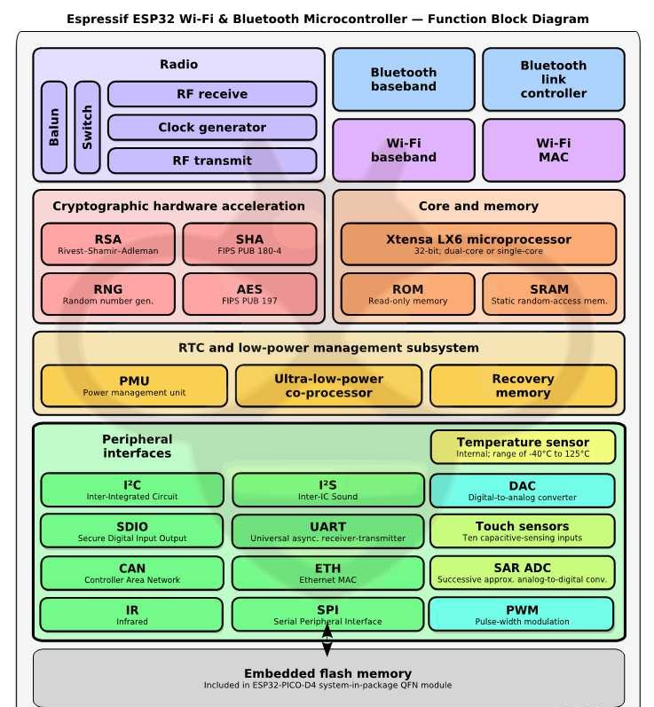
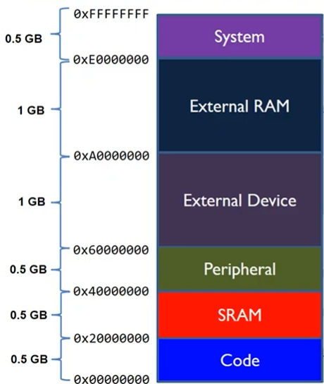
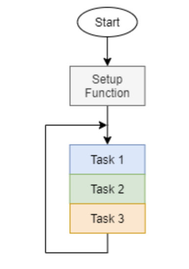
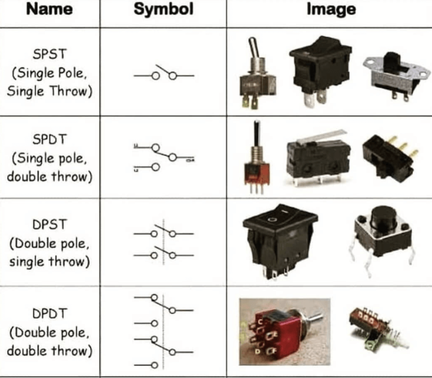
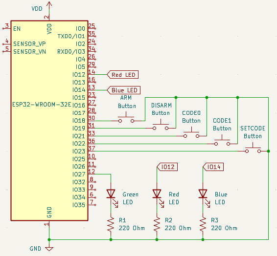
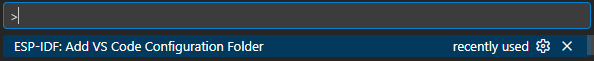

# Week 2 - Architecture, Program State, and Debouncing
---

This week steps up the software complexity, as we will be designing an alarm system. It will allow for code updates, guesses, and alarm state management through 5 input buttons and 3 status LEDs. This system provides a good framework to learn how to manage **state** and gather reliable digital inputs.


---

## 2.1 Content Overview

Before we get started on the software for this week, we're going to cover learn a bit about how your microcontroller works internally. 

### 2.1.1 The Breakout Board


This pinout gives you a connection diagram for the **breakout board**, which includes: 
* The USB port on the bottom
* The **EN** and **BOOT** buttons
* A USB to UART converter directly above the USB port (This is why you need to select UART as the flash method)
* A **Regulator** to step down the 5V power from the USB cable to the 3V the microcontroller needs, directly above the converter.
* Breakouts for the gpio pins
* Other components we will not cover today.

The silver square labeled **ESP32** is where the real magic happens. It is where all of your code is ran, memory is stored, and **peripherals** are housed. This diagram shows everything contained within the ESP32 module:




#### *Core and Memory*
Here we see the **Microprocessor** and **RAM**. The microprocessor is the brain executing your code, while the RAM provides temporary memory for your variables and data while the code runs.
#### *Embedded Flash Memory* 
This is where all of your code is stored every time you build and then flash to the device.
#### *Peripheral Interfaces*
In order to interact with the physical world, the microprocessor sends to and receives data from these **peripherals**. They include **UART**, which you've been using to print messages to your screen, **PWM** which we will cover next week, **GPIO** (although it isn't pictured), which you've been using to control LEDs and buttons so far, and many more. 

### 2.1.2 Memory Mapped IO & the Bus System
The main takeaway from the block diagram above is that the processor is just the brain; it relies on separate hardware peripherals to actually interact with the world. This communication requires a physical connection, which is called the **Bus**. We won't dive into how the bus works (take ECE 337/437 later on if this interests you), the important point is that the bus system is the interconnect for data transactions between the processor and peripherals. 

Now, you might be asking, how does the processor tell the bus "I want to send data to the GPIO peripheral"? The answer is **Memory Mapped IO**. 



>Note: This diagram is not the exact layout of the ESP32, but the concept is the same.

The **ESP32** has that 32 in the name because it is a 32-bit microcontroller. This means the CPU handles memory addresses that are 32 bits wide. Because an address is 32 bits long, there are **$2^{32}$** unique memory addresses available (about 4 GB). The common way to state this is that the ESP32 has a 4GB **address space**. Each one of these addresses corresponds to a unique byte, meaning a normal memory read/write applies to 4 addresses at once. If you want to read code from address 0x00000000, for example, the bus returns the bytes from **0x00000000**, **0x00000001**, **0x00000002**, and **0x00000003**.

In code written on general purpose machines like a windows desktop the physical location of your data is unknown to the user, as it is obscured by the operating system's virtual memory system (take ECE 437/469 if you're curious about VMEM). In most embedded systems, this is not the case. The 4GB **address space** of your ESP32 is divided up into chunks as shown above. There is only 4MB (may vary depending on chip model) of flash memory and a few hundred KB of RAM on the ESP32 though, which means not all of the 4GB is physically connected. Thus these chunks don't always represent physical memory blocks, but rather define the way the bus interprets a memory request. 

For example, every time you write  ```gpio_set_level(RED_LED_PIN, 1);```, under the hood the processor is saving that 1 to the memory address that represents the ```RED_LED_PIN```'s output register within the GPIO peripheral. The bus then sees this memory address and directs it to the correct physical location. This process works identically in reverse, if you want to ```gpio_get_level(RED_LED_PIN)``` the processor reads data from the memory address representing the ```RED_LED_PIN```'s input register, and the bus transmits it from the GPIO peripheral back to the processor.


### 2.1.3 Polling Program Design
Most embedded firmware applications can be broken down into two main types: **polling** and **event-driven** (which we will cover next week).

**Polling** is when the processor constantly runs through an infinite super-loop of code after an initial setup. This works for rather simple programs that follow a consistent program flow, but when complexity increases and demands on both timing and required computer increase, this approach is not sufficient.



### 2.1.4 Mechanical Switches
Understanding the inner workings of mechanical switches is important as they form the simplest manner of user input into a computer. We will be focussing on buttons but its important to note the different kinds of switches:



The buttons you will be using have four contacts oriented in a square around the button. From the image below, the top two contacts are connected together and the bottom two are connected. When the button is pressed, a spring is compressed, and the moving contact bridges the top two contacts to the button two contacts.


Since buttons are meant to input a binary 0 or 1 to the MCU, one terminal is generally connected to VDD (Logic HIGH ~3.3V) or GND (Logic LOW ~0V) while the other terminal is connected to a GPIO pin. This leads us to another important concept, **Pull-up & Pull-down** networks.


These networks allow the I/O pin to constantly have a defined logical value (0 or 1). Without them, when a button isn't pressed it leaves the I/O pin floating somewhere between 0 and 3.3V, resulting in garbage data being read by the pin. To combat this, pull-up/pull-down resistors are implemented as the image above shows. Some examples:   

* If you connect the I/O pin's terminal to the 3V rail through a pull-up resistor, and the other button terminal to ground, the pin's reading will stay at 1 until the button is pressed, which shorts the circuit to ground and results in a reading of 0.

* If you connect the I/O pin's terminal to the ground rail through a pull-down resistor, and the other button terminal to the 3V rail, the pin's reading will stay at 0 until the button is pressed, which shorts the circuit to 3V and results in a reading of 1.

---

### 2.1.5 Software & Hardware Debouncing
Now that you know how to interface a button, an important step is making the signal you read from the button clean! A clean signal is on that is free from noise. Below is a noisy button press, otherwise known as bouncing.


When a mechanical button is pressed or released, the internal contacts do not immediately settle into a stable state. Instead, they rapidly make and break contact for a short period of time, typically on the order of a few milliseconds. To a microcontroller, this bouncing can appear as multiple button presses, leading to unintended behavior in your program.

**Hardware Debouncing**
One common hardware-based solution is the use of a low-pass RC filter. By placing a resistor and capacitor in series with the button, rapid voltage changes caused by bouncing are smoothed out before reaching the MCU input pin.

The capacitor charges and discharges slowly relative to the bounce duration, effectively filtering out short, unwanted transitions. Hardware debouncing has the advantage of reducing noise before the signal ever reaches the microcontroller, but it requires additional components and reduces flexibility.

**Software Debouncing**
Software debouncing is often preferred in embedded systems due to its flexibility and minimal hardware requirements. In software debouncing, the firmware waits for the button signal to remain stable for a fixed amount of time before considering it a valid press.

A common approach is:

1.	Detect a change in button state
2.	Wait a short delay (e.g., 10–50 ms)
3.	Re-read the button state
4.	Confirm the press only if the state is unchanged

This method ensures that transient noise does not trigger false events. Software debouncing is easy to tune and can be implemented using timers, counters, or RTOS delays.

### 2.1.6 State Based Programs & Finite State Machine (FSM) Diagrams
**State** is the variable values and mode of operation that persist across iterations of a system's super-loop. At any given time, the system exists in exactly one state and behaves according to the rules of that state. Transitions between states occur in response to events, such as button presses, timers expiring, or sensor thresholds being crossed.

For example, a simple house alarm system may include states such as:
- DISARMED
- ARMED
- ALARM_TRIGGERED
- CODE_ENTRY

Each of these states defines what the system should do with inputs and outputs. For instance, LED indicators may change color depending on the current state, and button presses may have different meanings depending on which state the system is in.

An FSM diagram is a visual representation of this behavior. States are typically drawn as circles, while transitions are drawn as arrows labeled with the event that causes the transition. FSM diagrams allow engineers to reason about system behavior before writing any code, helping to catch logical errors early and making the program easier to debug and extend.

In firmware, FSMs are often implemented using:
- Enumerated types to represent states
- A variable that tracks the current state
- Event handlers or conditional logic that perform state transitions

By organizing your alarm system as a finite state machine, you ensure that system behavior is predictable, scalable, and easy to reason about. This approach is especially valuable in embedded systems where incorrect state transitions can lead to unsafe or unintended behavior.

In this lab, you will design and implement an FSM that controls the alarm system’s operation, handles user input through button presses, and updates LED indicators to reflect the current system state.

## 2.2 Coding Activity

### 2.2.1 Circuit Setup



>Please feel free to ask for help with wiring the circuit if you need any!

### 2.2.2 Environment Setup

Before you begin, please remember to create a new project:
1. Press ```ctrl+shift+p``` to open up the command panel
2. Look for ```ESP-IDF: Create New Empty Project```  


3. Enter a folder name in the popup window


4. Select a location for the new folder (organize however you like!)

5. Replace the ```main``` folder of your new project with the version provided in this week's github folder.  


6. Press `ctrl + shift + p` to open the VSCode command panel again, and run **Add VS Code Configuration Folder**.


### 2.2.3 Software

#### Headers

```C
#include <stdio.h>
#include "freertos/FreeRTOS.h"
#include "freertos/task.h"
#include "esp_log.h"
#include "esp_timer.h"
#include "driver/gpio.h"
```

Every week we'll have an explanation for the new header files included in the activity, this week it's all of them!

* `stdio.h` C standard library for I/O, includes functions like `printf`

* `FreeRTOS.h` & `task.h` RTOS (real-time operating system, will be covered further in week 7) files mainly used for sleep functions

* `esp_log.h` Used for `ESP_LOGI` function, which functions like printf

* `esp_timer.h` Used for getting current time since program start

* `gpio.h` This file provides all of the functions and data structures we need to interact with the gpio peripheral

#### Macros and Globals

Every week we will also provide an explanation for any new macros and global variables, which there are many of this week. It will not always be so as we build on this week's activity.

```C
#define GREEN_LED_PIN 27
#define RED_LED_PIN 14
#define BLUE_LED_PIN 12

#define ARM_PIN 18
#define DISARM_PIN 19
#define CODE0_PIN 21
#define CODE1_PIN 22
#define SETCODE_PIN 23

#define DEBOUNCE 250 * 1000
#define ALARM_PERIOD 200 * 1000
```

These **macros** define global constants that we can use anywhere in the program. The compiler directly substitutes the value to the right for the name when you use them in your code. These make your code much easier to read and reason about, so please use them! They are very useful when defining pin numbers as we have here, especially as a project gets more complicated.

```C
gpio_config_t input_pin
gpio_config_t output_pin
```

These variables store configuration data for the gpio pins you'll use to interface with the buttons and LEDs. We define them at the top as **globals** because we need to use them in multiple functions.

```C
// Alarm variables
bool alarm_triggered = false;
bool alarm_flash = false;
bool alarm_armed = false;
bool setting_code = false;
uint8_t code = 0b00000000;
uint8_t temp_code = 0b00000000;
uint8_t guess_code = 0b00000000;
```

These variables hold the **program state** as mentioned in section **2.1.6**. They are given default values here, but can be changed later in the program.

```C
// Debounce variables
intmax_t previous_alarm_beep = 0;
intmax_t previous_arm_press = 0;
intmax_t previous_disarm_press = 0;
intmax_t previous_setcode_press = 0;
intmax_t previous_code1_press = 0;
intmax_t previous_code0_press = 0;
```

These variables are all timestamps, used to measure against current time when debouncing the input buttons.

#### Functions

* `handle_arm_disarm` Handles the button presses from the arm and disarm buttons. It is in charge of debouncing them using the appropriate global timestamps for each button, updating program state accordingly, and logging when notable events occur.

* `handle_set_code` Handles presses from the setcode button as well as presses from the code0 and code1 buttons when updating the alarm's passcode. It is also in charge of debouncing, updating program state, and logging. 

* `handle_guess_code` Handles presses from the code0 and code1 buttons when the alarm is armed. It is also in charge of debouncing, updating program state, and logging. 

* `update_leds` Reads the current program state and updates the output LEDs to reflect it.

* `app_main` This week's main loop follows the polling design method. It does a few lines of setup, and then infinitely loops through the 4 functions mentioned above, with a small delay inserted between each iteration.

#### To Do

1. Fill in the missing lines in `handle_arm_disarm`
2. Fill in the missing lines in `handle_set_code`
3. Fill in the missing lines in `handle_guess_code`
4. Fill in the missing lines in `update_leds`
5. Fill in the missing lines in `app_main`

You will find more detailed instructions in the template code provided, but feel free to ask questions if you get stuck!

## 2.3 Helpful Links

#### Documentation
* [ESP32 WROOM 32E Pinout](https://docs.sunfounder.com/projects/umsk/en/latest/07_appendix/esp32_wroom_32e.html)
* [ESP32 Technical Reference Manual](https://documentation.espressif.com/esp32_technical_reference_manual_en.pdf#iomuxgpio)
* [ESP-IDF Docs](https://docs.espressif.com/projects/esp-idf/en/stable/esp32/index.html)

#### Environment Setup
* [IDF Frontend (if you're curious)](https://docs.espressif.com/projects/esp-idf/en/stable/esp32/api-guides/tools/idf-py.html)
* [Dev Container Setup](https://docs.espressif.com/projects/vscode-esp-idf-extension/en/latest/additionalfeatures/docker-container.html)
* [WSL](https://learn.microsoft.com/en-us/windows/wsl/basic-commands)
* [USBIPD](https://github.com/dorssel/usbipd-win)