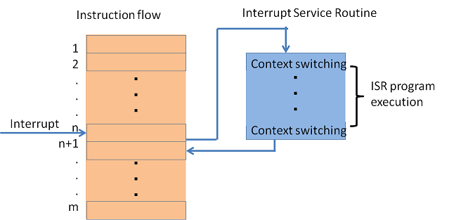
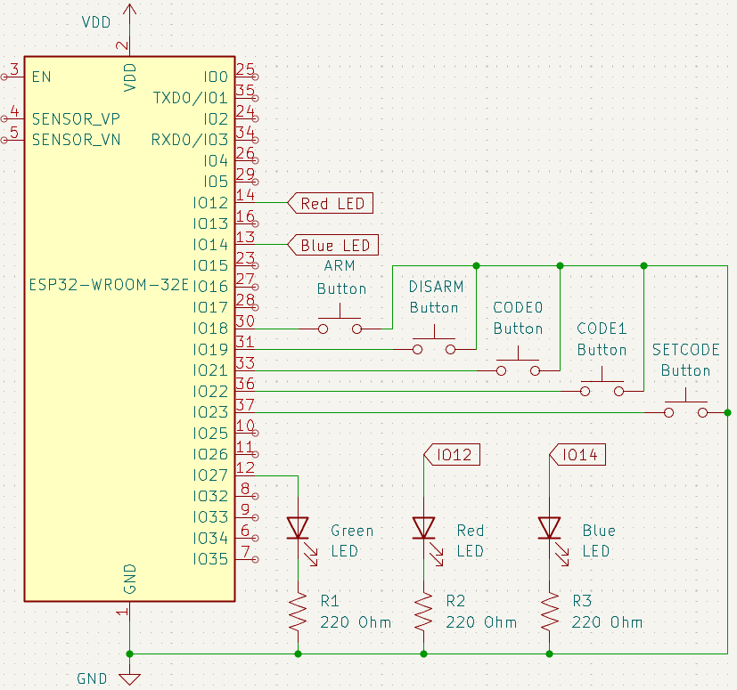

# BEEP WEEK 3 README
---
## 3.1 Content Overview

### 3.1.1 Introduction
This week we will be building on the design from last week while introducing the concept of **interrupts**. Before that, however, a bit on how your microcontroller works internally. 


This pinout gives you a connection diagram for the **breakout board**, which includes: 
* The USB port on the bottom
* The **EN** and **BOOT** buttons
* A USB to UART converter directly above the USB port (This is why you need to select UART as the flash method)
* A **Regulator** to step down the 5V power from the USB cable to the 3V the microcontroller needs, directly above the converter.
* Breakouts for the gpio pins
* And other components we will not cover today.

The silver square labeled **ESP32** is where the real magic happens. It is where all of your code is ran, memory is stored, and **peripherals** are housed. This diagram shows everything contained within the ESP32 module:


#### *Core and Memory*
Here we see the **Microprocessor** and **RAM**, this is where all of your code is ran and temporary memory is used.
#### *Embedded Flash Memory* 
This is where all of your code is stored every time you build and then flash to the device.
#### *Peripheral Interfaces*
In order to interact with the physical world, the microprocessor sends to and receives data from these **peripherals**. They include **UART**, which you've been using to print messages to your screen, **PWM** which we will cover next week, **GPIO** (although it isn't pictured), which you've been using to control LEDs and buttons so far, and many more. 

### 3.1.2 Memory Mapped IO & the Bus System
The main takeaway from the block diagram above is that the processor running your code is *separate* from the peripherals it communicates with, allowing the processor to offload some responsibility. This communication requires a physical connection, which is called the **Bus**. We won't dive into how the bus works (take ECE 337/437 later on if this interests you), the important point is that the bus system is the interconnect for data transactions between the processor and peripherals. 

Now, you might be asking, how does the processor tell the bus "I want to send data to GPIO"? The answer is **Memory Mapped IO**. 


>Note: This diagram is not the exact layout of the ESP32, but the concept is the same.

In code you have written so far, when you save a variable to memory you may not know the exact address it is going to. In embedded systems, this is not the case. The 4MB (varies depending on chip model) of storage on your ESP32 is divided up into chunks as shown above. The peripheral chunk is then divided further into GPIO, UART, etc. Every time you write  ```gpio_set_level(RED_LED_PIN, 1);```, under the hood the processor is saving that 1 to the memory address that represents the ```RED_LED_PIN```'s output within the GPIO peripheral chunk. The bus then sees this memory address and directs it to the correct physical location. This process works identically in reverse, if you want to ```gpio_get_level(RED_LED_PIN)``` the processor reads data from the memory address representing the ```RED_LED_PIN```'s input, and the bus transmits it from the GPIO peripheral back to the processor.

### 3.1.3 Interrupts

Now that we've covered peripherals and sending/receiving data, it's time to talk about interrupts. Interrupts are configurable signals generated by peripherals, internal processor hardware, or software to let the processor know an event needs to be immediately addressed. If configured correctly, once the interrupt is **fired** by the source it causes the processor to save its state, switch contexts, and execute a function called an **Interrupt Service Routine (ISR)** or **Interrupt Handler** before restoring state and resuming the main execution flow.



After an interrupt is fired, but before it is **acknowledged** by the ISR it is considered **pending**. Commonly interrupts (like a rising edge on a gpio pin) are always fired when the event occurs regardless of whether they have been enabled and they are **masked** before reaching the processor. In this scheme the bitmask acts as the enable/disable signal. Many systems also have nested interrupt controllers, where a peripheral may have several distinct interrupt sources but one combined interrupt sent to the processor.   

The ESP32 system is similar, with up to 71 distinct interrupt sources and only 32 slots on the processor (some of the 71 sources and 32 slots are reserved, read the [interrupt matrix section](https://documentation.espressif.com/esp32_technical_reference_manual_en.pdf) in the technical reference manual if you're curious). ESP32 allows you to connect any of the sources to any of the slots. If several interrupts are mapped to the same slot and ISR, you need to check the interrupt status registers in the ISR in order to figure out what source triggered it.


More on those slots, each has a set **priority** which determines the **pre-emption order**. As seen above, interrupts can interrupt each other, with higher priority slots interrupting lower prioity ones. Levels range from 1-7, with higher numbers being allocated for watchdog timers or other critical internal systems and lower ones for peripherals.

### 3.1.4 Interrupt Service Routines, Best Practices

Interrupt Service Routines, especially in a multi-threaded system, should be short and simple. Examples of typical ISR responsibilities include setting a flag or semaphore (discussed in a later week), moving data from a register into a queue, or toggling gpio pins. Things like grabbing mutexes (discussed in a later week), performing complex math or string manipulation, or initiating communications (UART, I2C, etc.) are discouraged. If an ISR is too long it can starve the main loop or lower priority interrupts of CPU time, especially if its periodic. In multi-threaded or multi-core systems they can also cause deadlock (discussed in a later week) if mutexes are improperly used.

### 3.1.5 Shared & Volatile Memory

When translating C code into assembly, the compiler may attempt to optimize out unnecessary reads to variables (depends on the optimization level chosen, think -O0, -01, etc.). Here is an example of a potential situation:
```C
bool flag = false

void isr() {
    flag = true;
}

int main () {
    for (;;) {
        if (flag) {
            ///some code
        }
    }
    return false
}
```
The compiler sees that nothing in the loop changes the flag and so doesn't actually get that variable from memory every iteration, instead reading it once and checking that stale value every time after. This can of course lead to incorrect behavior that may be hard to spot. Marking a variable as **volatile**:
```C
volatile bool flag = false;
```
tells the compiler that this variable is being modified by other sources and prevents it from optimizing out the memory access. This is useful for variables modified by ISRs, other threads in a multi-threaded context, and other cores in a multi-core context.

### Interrupt Source Examples

#### GPIO
* Level High/Low
* Positive/Negative Edge

#### Timers
* Alarm trigger threshold reached

#### Comms (UART, I2C, etc.)
* Received/Transmitted 
* Buffer Full/Empty
* Various Errors, Timeouts


## 3.2 Activity

### 3.2.1 Wiring

#### Suggested Layout

>Same as last week!

#### KiCAD Wiring Schematic



### 3.2.2 Setup

Before you begin, please remember to create a new project:
1. Press ```ctrl+shift+p``` to open up the command panel
2. Look for ```ESP-IDF: Create New Empty Project```


3. Enter a folder name in the popup window


4. Select a location for the new folder (organize however you like!)

5. Replace the ```main.c``` & ```CMakeLists.txt``` files in the ```main``` folder of your new project with the versions provided in this week's github folder.


### 3.2.3 Included Libraries
```C
#include <stdio.h>
```
For C Standard Library functions.

```C
#include "freertos/FreeRTOS.h"
#include "freertos/task.h"
```
For FreeRTOS task support and delay function to prevent timeout.

```C
#include "esp_log.h"
```
For logging(printing) statements to your monitoring window.

```C
#include "esp_timer.h"
```
For timekeeping and debouncing help.

```C
#include "driver/gpio.h"
```
For GPIO functions and structs.

### 3.2.4 Global Variables
```C
#define GREEN_LED_PIN 27
#define RED_LED_PIN 14
#define BLUE_LED_PIN 12

#define ARM_PIN 18
#define DISARM_PIN 19
#define CODE0_PIN 21
#define CODE1_PIN 22
#define SETCODE_PIN 23
```
Pin definitions for use in your code.

```C
#define DEBOUNCE 250 * 1000
#define ALARM_PERIOD 200 * 1000
```
Constants for button debouncing and LED flashing.

### 3.2.5 Coding

The objective for this week is the same as week 2, a programmable alarm system. However, instead of continuously polling the button states in main, we will offload the button handling to ISRs.  

Generally, GPIO interrupts are all mapped to the same ISR slot, meaning they all trigger the same function. This means we'd have to check the interrupt status for each button to determine which one was actually pressed. Thankfully, the ESP-IDF can do this for us! Using ```gpio_install_isr_service()``` sets up the IDF's built-in function to check specific button triggers and call individual handlers, allowing us to use separate functions for each button. These are:
```C
static void handle_arm_press(void *arg)
```
```C
static void handle_disarm_press(void *arg)
```
```C
static void handle_setcode_press(void *arg)
```
```C
static void handle_code0_press(void *arg)
```
```C
static void handle_code1_press(void *arg)
```

The main loop is still handling ```update_leds()``` as well as printing, which is an important note. As mentioned in 3.1.4, ISRs should be short and avoid communications. This includes ```printf()``` or ```ESP_LOGI()``` calls, which print those characters to your screen over UART. This is usually just a convention that programmers follow, but the ESP IDF enforces it strictly. Your code will error out during runtime if you try to print or log from an ISR.

The other new function this week is ```setup_gpio_irq()```, which will setup the interrupts and add the correct function handlers for each button. This comes in two steps:

1. ```void gpio_install_isr_service(interrupt type)``` 
which tells the processor we want to enable edge triggered gpio interrupts and allows us to setup different handlers for each one.  
2. ```gpio_isr_handler_add(pin number, handler function name, NULL)``` which adds a handler function for a specific pin. You should do this 5 times, one each for the arm, disarm, setcode, code0, and code1 pins.

To fill out the handler functions, split out the if statement blocks from ```handle_set_code()```, ```handle_guess_code()```, ```handle_arm_disarm()``` by which button they are checking. Note that some parts of these checks are no longer necessary (like checking the level of a button, that's a given if the interrupt has been triggered!). Check the code scaffolding for detailed explanations of each function.

## 3.3 Helpful Links

#### Documentation
* [ESP32 WROOM 32E Pinout](https://docs.sunfounder.com/projects/umsk/en/latest/07_appendix/esp32_wroom_32e.html)
* [ESP32 Technical Reference Manual](https://documentation.espressif.com/esp32_technical_reference_manual_en.pdf#iomuxgpio)
* [ESP-IDF Docs](https://docs.espressif.com/projects/esp-idf/en/stable/esp32/index.html)

#### Environment Setup
* [IDF Frontend (if you're curious)](https://docs.espressif.com/projects/esp-idf/en/stable/esp32/api-guides/tools/idf-py.html)
* [Dev Container Setup](https://docs.espressif.com/projects/vscode-esp-idf-extension/en/latest/additionalfeatures/docker-container.html)
* [WSL](https://learn.microsoft.com/en-us/windows/wsl/basic-commands)
* [USBIPD](https://github.com/dorssel/usbipd-win)