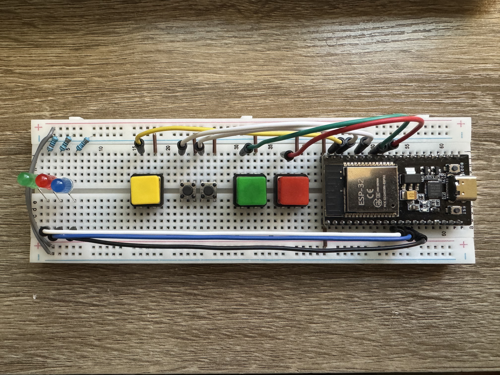
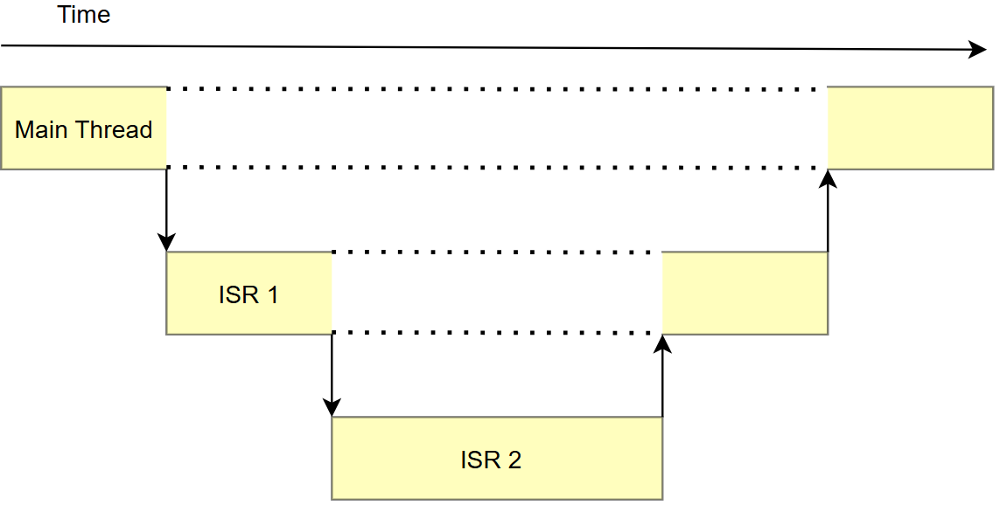

# BEEP WEEK 3 README
---

This week builds upon last week's alarm system. It implements the same functionality, but refactored from a polling loop to an event-driven design. 



---
## 3.1 Content Overview

When program complexity grows, polling designs are generally inefficient  due to the inability to **context switch**. Context switching is when the CPU saves its state (what instruction it is executing, its internal registers, etc.), jumps to a different function, executes it, and returns back to the previous save-state when it has finished the code/function. This allows for the CPU to be **interrupted** and dragged away from the main super-loop. 

Context switching is necessary for **event-driven** design. The ability to context switch and save CPU state allows the CPU to handle things in real-time rather than waiting for it to be processed in the next iteration of a super loop. An event can be anything and is user defined, but some good examples are: button presses, timers, UART/SPI/I2C errors, etc.

### 3.1.1 Interrupts

Interrupts are configurable signals generated by peripherals, internal processor hardware, or software to let the processor know an event needs to be immediately addressed. If configured correctly, once the interrupt is **fired** by the source it causes the processor to save its state, switch contexts, and execute a function called an **Interrupt Service Routine (ISR)** or **Interrupt Handler** before restoring state and resuming the main execution flow.


After an interrupt is fired, but before it is **acknowledged** by the ISR it is considered **pending**. Commonly interrupts (like a rising edge on a gpio pin) are always fired when the event occurs regardless of whether they have been enabled and they are **masked** before reaching the processor. In this scheme the bitmask acts as the enable/disable signal. Many systems also have nested interrupt controllers, where a peripheral may have several distinct interrupt sources but one combined interrupt sent to the processor.   

The ESP32 system is similar, with up to 71 distinct interrupt sources and only 32 slots on the processor (some of the 71 sources and 32 slots are reserved, read the [interrupt matrix section](https://documentation.espressif.com/esp32_technical_reference_manual_en.pdf) in the technical reference manual if you're curious). ESP32 allows you to connect any of the sources to any of the slots. If several interrupts are mapped to the same slot and ISR, you need to check the interrupt status registers in the ISR in order to figure out what source triggered it.



More on those slots, each has a set **priority** which determines the **pre-emption order**. As seen above, interrupts can interrupt each other, with higher priority slots interrupting lower prioity ones. Levels range from 1-7, with higher numbers being allocated for watchdog timers or other critical internal systems and lower ones for peripherals.

### 3.1.2 Interrupt Service Routines, Best Practices

Interrupt Service Routines, especially in a multi-threaded system, should be short and simple. Examples of typical ISR responsibilities include setting a flag or semaphore (discussed in a later week), moving data from a register into a queue, or toggling gpio pins. Things like grabbing mutexes (discussed in a later week), performing complex math or string manipulation, or initiating communications (UART, I2C, etc.) are discouraged. If an ISR is too long it can starve the main loop or lower priority interrupts of CPU time, especially if its periodic. In multi-threaded or multi-core systems they can also cause deadlock (discussed in a later week) if mutexes are improperly used.

### 3.1.3 Shared & Volatile Memory

When translating C code into assembly, the compiler may attempt to optimize out unnecessary reads to variables (depends on the optimization level chosen, think -O0, -01, etc.). Here is an example of a potential situation:
```C
bool flag = false

void isr() {
    flag = true;
}

int main () {
    for (;;) {
        if (flag) {
            ///some code
        }
    }
    return false
}
```
The compiler sees that nothing in the loop changes the flag and so doesn't actually get that variable from memory every iteration, instead reading it once and checking that stale value every time after. This can of course lead to incorrect behavior that may be hard to spot. Marking a variable as **volatile**:
```C
volatile bool flag = false;
```
tells the compiler that this variable is being modified by other sources and prevents it from optimizing out the memory access. This is useful for variables modified by ISRs, other threads in a multi-threaded context, and other cores in a multi-core context.

### Interrupt Source Examples

#### GPIO
* Level High/Low
* Positive/Negative Edge

#### Timers
* Alarm trigger threshold reached

#### Comms (UART, I2C, etc.)
* Received/Transmitted 
* Buffer Full/Empty
* Various Errors, Timeouts


## 3.2 Coding Activity

### 3.2.1 Circuit Setup


### 3.2.2 Environment Setup

Before you begin, please remember to create a new project:
1. Press ```ctrl+shift+p``` to open up the command panel
2. Look for ```ESP-IDF: Create New Empty Project```  


3. Enter a folder name in the popup window


4. Select a location for the new folder (organize however you like!)

5. Replace the ```main``` folder of your new project with the version provided in this week's github folder.  


6. Press `ctrl + shift + p` to open the VSCode command panel again, and run **Add VS Code Configuration Folder**.


### 3.2.3 Software

#### Headers

No new included header files this week!

#### Macros and Globals

```C
volatile bool newly_armed = false;
volatile bool newly_disarmed = false;
volatile bool new_code_set = false;
volatile bool newly_triggered = false;
```

#### Functions

* `handle_arm_press`,  `handle_disarm_press`, `handle_setcode_press`, `handle_code0_press`, and  `hanldl_code1_press` all ISRs which handle their respective button press events. They ensure proper debouncing, update program state, and set logging flags for the main loop.

* `update_leds` is unchanged from last week.

* `setup_gpio_irq` configures the gpio interrupts to call the 5 handlers, one for each button.

#### Notes

The main loop is still handling ```update_leds()``` as well as printing, which is an important note. As mentioned in 3.1.2, ISRs should be short and avoid communications. This includes ```printf()``` or ```ESP_LOGI()``` calls, which print those characters to your screen over UART. This is usually just a convention that programmers follow, but the ESP IDF enforces it strictly. Your code will error out during runtime if you try to print or log from an ISR.

Generally, GPIO interrupts are all mapped to the same ISR slot, meaning they all trigger the same function. This means we'd have to check the interrupt status for each button to determine which one was actually pressed. Thankfully, the ESP-IDF can do this for us! Using ```gpio_install_isr_service()``` sets up the IDF's built-in function to check specific button triggers and call individual handlers, allowing us to use separate functions for each button.

#### To Do

1. Fill in the missing lines in all 5 button ISRs.
2. Fill in the missing lines in `setup_gpio_irq`.
3. Fill in the blanks in the global gpio pin configs.

## 3.3 Helpful Links

#### Documentation
* [ESP32 WROOM 32E Pinout](https://docs.sunfounder.com/projects/umsk/en/latest/07_appendix/esp32_wroom_32e.html)
* [ESP32 Technical Reference Manual](https://documentation.espressif.com/esp32_technical_reference_manual_en.pdf#iomuxgpio)
* [ESP-IDF Docs](https://docs.espressif.com/projects/esp-idf/en/stable/esp32/index.html)

#### Environment Setup
* [IDF Frontend (if you're curious)](https://docs.espressif.com/projects/esp-idf/en/stable/esp32/api-guides/tools/idf-py.html)
* [Dev Container Setup](https://docs.espressif.com/projects/vscode-esp-idf-extension/en/latest/additionalfeatures/docker-container.html)
* [WSL](https://learn.microsoft.com/en-us/windows/wsl/basic-commands)
* [USBIPD](https://github.com/dorssel/usbipd-win)