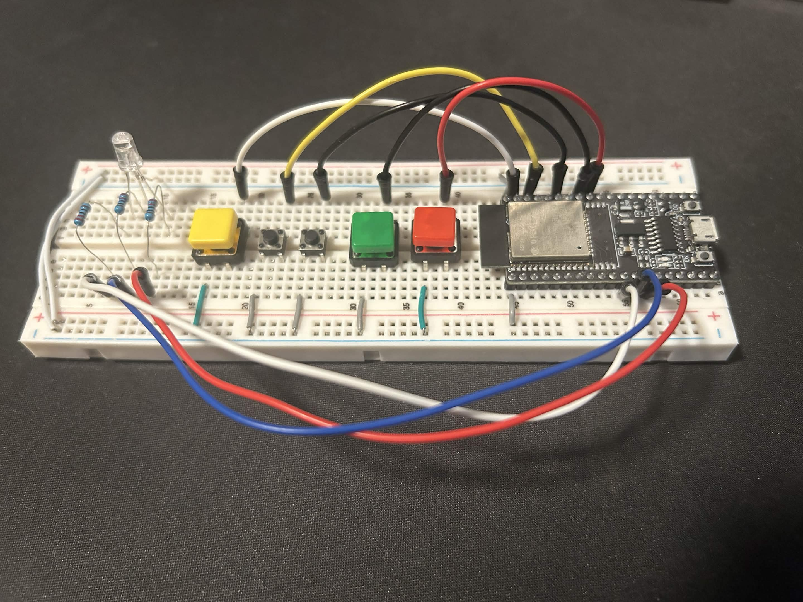
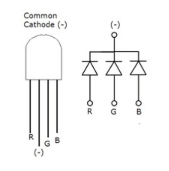
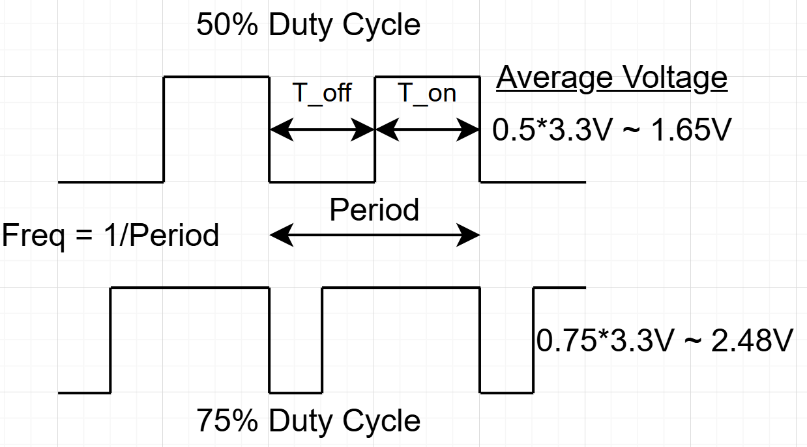
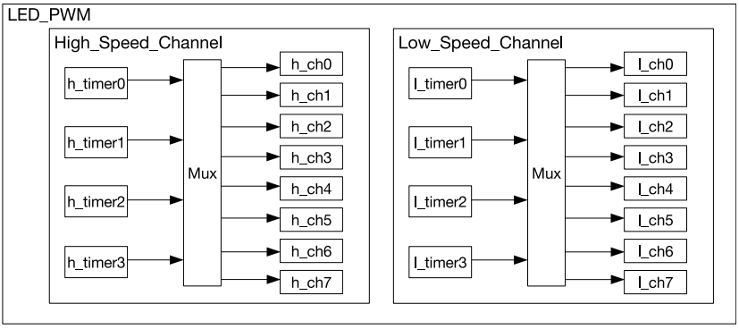
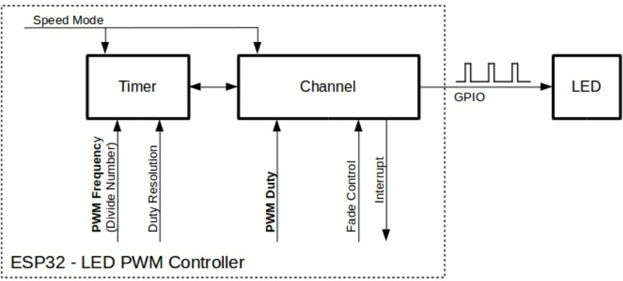
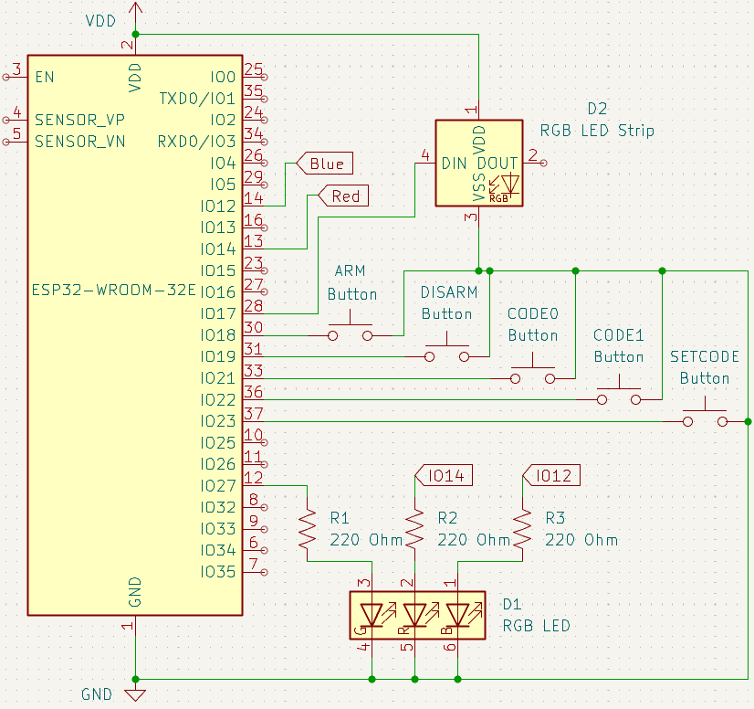
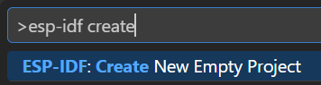
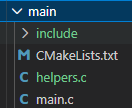

# BEEP WEEK 4 README
 
This week is focused on methods for controlling an RGB LED, adjusting the brightness and color. Through another extension of the alarm system we'll demonstrate what's possible when utilizing internal hardware timers, interrupts, and pulse width modulation (PWM) controllers.  

  

---
## 4.1 Content Overview

### RGB LED



RGB LEDs typically have 4 pins, one each for red, green, and blue and a common anode or cathode. The model we are using is common cathode, which means the color pins share a ground connection and must be connected to Vdd in order to light up. By varying the voltages across each pin with PWM you can mix the colors to create almost any combination.

### Hardware Timers (GPTimer)
The ESP32 model we are using's timer peripheral contains two general-purpose timer modules with two timers per module. All 4 are identical 64-bit, up/down configurable counters. While they are module pairs, they have independent configuration registers and interrupt generation. These timers base their count off of the APB_CLK source (80 MHz) and divide that with a 16-bit prescaler register to produce each 'tick' of the timer. The valid prescaler values range between 2 and 65536 which means the shortest tick granularity is `1 / (80,000,000 / 2) = 25ns` and the longest is `1 / (80,000,000 / 65536) = 0.8192ms`.   

After setting the tick speed, usually to some round number like 1us, we need to setup an alarm. Each timer has its own alarm which can be setup to trigger when the counter reaches a specified value. Usually alarms trigger an interrupt, which calls a user-defined callback where we can set flags, flip gpio pins, etc. These alarms can be configured in two modes: single shot, where they fire and then leave the counter running, and periodic, where the alarm fires and then resets the timer's counter in a loop until disabled. The alarm threshold and reset value are also configurable.

The ESP32 also has two system timers the **RTC TIMER** for low-power and sleep modes, and the **High Resolution Timer** which is used by the esp_timer software driver. The esp_timer driver allows us to measure the time since boot in us with `esp_timer_get_time()`, which is useful for things like software debouncing.

> Example setup for an alarm that fires every 100ms:  
> `Prescaler = 80` >> `1 / (80,000,000 / 80) = 1us`  
> `Alarm threshold = 100000` >> `1us * 100000 = 100ms`  
>  `Alarm reset value = 0`

### PWM

Pulse-width modulation is the process of rapidly oscillating a digital signal to produce a square wave, varying the *duty cycle* to alter the signal.



Duty cycle describes the percentage of the period that the voltage is high, and varying this percentage changes the average voltage across the pin. It is varied by changing the threshold value of a counter, which will toggle the pin on/off when the threshold is reached. In most configurations the pin also toggles when the counter reaches its max (or wrap) value and resets to zero (some PWM peripherals allow configurable count directions, reset values, and wrap behavior). The PWM peripheral can be used to control all kinds of devices that require varying voltage, such as LEDs and motors. Its also possible to produce rudimentary audio by feeding the PWM output through a low-pass filter.

### LED Control PWM (LEDC)

The ESP32 has two PWM peripherals, MCPWM for motor control and LEDC for LEDs. 



The LEDC peripheral has two channels, high and low speed. The low speed channel applies duty cycle changes whenever told to by software, potentially causing glitchy output if the threshold value is changed during the middle of a period. The high speed channel uses register buffers to wait until the counter wraps before changing the threshold, and thus the duty cycle. This provides glitchless output regardless of software timing.  

Each speed channel has 4 timers and 8 channels, configured like so:


To setup PWM channels you first need to setup the base timer for its counter, similar to how you would setup a gptimer with tick resolution and frequency. After this, you have to setup the channel specifically to configure its interrupt (if needed), set the duty cycle, and connect it to a gpio pin.

## 4.2 Coding Activity

### 4.2.1 Circuit Setup



### 4.2.2 Environment Setup

Before you begin, please remember to create a new project:
1. Press ```ctrl+shift+p``` to open up the command panel
2. Look for ```ESP-IDF: Create New Empty Project```  


3. Enter a folder name in the popup window


4. Select a location for the new folder (organize however you like!)

5. Replace the ```main``` folder of your new project with the version provided in this week's github folder.  


6. Press `ctrl + shift + p` to open the VSCode command panel again, and run **Add VS Code Configuration Folder**.


### 4.2.3 Software

#### Headers

```C
#include "driver/gptimer.h"
#include "driver/rmt_tx.h"  
#include "driver/ledc.h"
```
These header files provide all of the necessary data structures and functions to interact with the timer, ledc, and RMT peripherals, just the same as `gpio.h` does for the gpio peripheral.

#### Globals and Macros

```C
int brightness = 0;
int step = 50;
```
These store global state for the RGB LED, determing the current brightness and rate at which it flashes when the alarm is triggered.

```C
gptimer_handle_t timer_handle;
```
This handle is used by multiple functions and allows us to reference the timer struct we create globally in the program. Good practice to make this a global or local within app_main (or whatever task is using it).

```C
volatile bool timer_triggered = false;
```
One more ISR flag used for triggering brightness changes while flashing the LED during alarm triggers.

#### Functions

* `update_leds` has the same responsibilities as before, updating the LEDs to reflect current program state, but this week it uses the LEDC peripheral instead of gpio.

* `timer_setup` sets up the general purpose timer that is used to trigger LED brightness updates.

* `pwm_setup` sets up the pwm peripheral that is used to control the RGB LED and reflect program state.

* `timer_handler` is the ISR for the general purpose timer setup by `timer_setup`

#### To Do

1. Fill in the missing lines in `timer_setup`
2. Fill in the missing lines in `pwm_setup`
3. Fill in the missing lines in `update_leds`

## 4.3 Bonus

### RMT
Typically used for IR communications like a TV remote, the [remote control transceiver](https://docs.espressif.com/projects/esp-idf/en/stable/esp32/api-reference/peripherals/rmt.html) encodes data in a similar manner to PWM by periodically alternating between digital low and high. The general setup steps are as follows:
1. Set a tick resolution (# of nanoseconds per tick)
2. Configure binary encoding by setting tick count for logic high and low for 0 and 1.
```C
rmt_symbol_word_t bit0 = {
    .duration0 = T0L_TICKS,
    .level0 = 0,
    .duration1 = T0H_TICKS,
    .level1 = 1
};
rmt_symbol_word_t bit1 = {
    .duration0 = T1L_TICKS,
    .level0 = 0,
    .duration1 = T1H_TICKS,
    .level1 = 1
};
```
3. Set MSB or LSB first and choose gpio pin.

This peripheral can also be used to control RGB LED strips such as the WS2812B. For a strip of 8 LEDs, an array of 24 8-bit integers is required, 1 byte per color per LED. 
```C
//build current iteration pattern array
int8_t pattern[24] = {0};
target = (pixel*3) + offset;
pattern[target] = strip_brightness[pixel];
//transmit
rmt_transmit(rmt_handle,encoder_handle,pattern,24,&rmt_tx_config);
//increment
pixel = pixel + direction;
if (pixel==7) {
    direction = -1;
}
if (pixel==0) {
    direction = 1;
    offset = (offset+1) % 3;
}
```
This pattern walks back and forth over the 8 LEDs, one color at a time. Experiment with the increment choices and color mixing to see what other patterns you can create!

## 4.4 Helpful Links

#### Documentation
* [ESP32 WROOM 32E Pinout](https://docs.sunfounder.com/projects/umsk/en/latest/07_appendix/esp32_wroom_32e.html)
* [ESP32 Technical Reference Manual](https://documentation.espressif.com/esp32_technical_reference_manual_en.pdf#iomuxgpio)
* [ESP-IDF Docs](https://docs.espressif.com/projects/esp-idf/en/stable/esp32/index.html)

#### Environment Setup
* [IDF Frontend (if you're curious)](https://docs.espressif.com/projects/esp-idf/en/stable/esp32/api-guides/tools/idf-py.html)
* [Dev Container Setup](https://docs.espressif.com/projects/vscode-esp-idf-extension/en/latest/additionalfeatures/docker-container.html)
* [WSL](https://learn.microsoft.com/en-us/windows/wsl/basic-commands)
* [USBIPD](https://github.com/dorssel/usbipd-win)