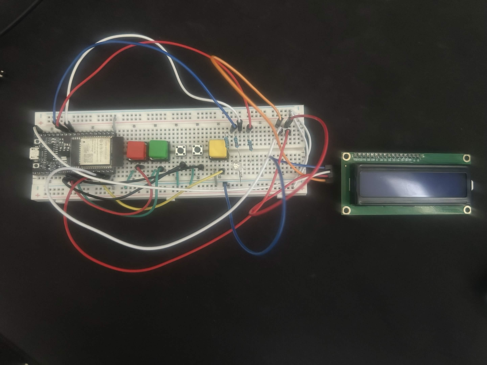
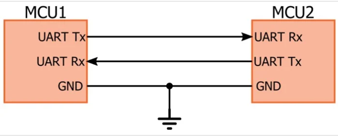
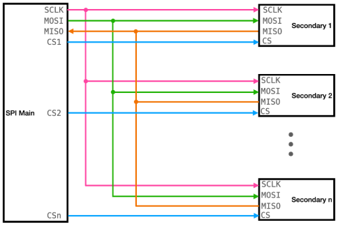
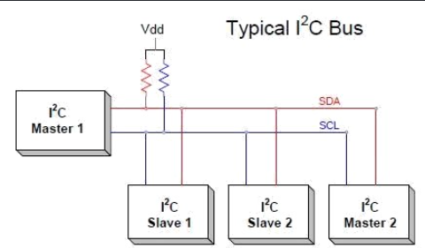
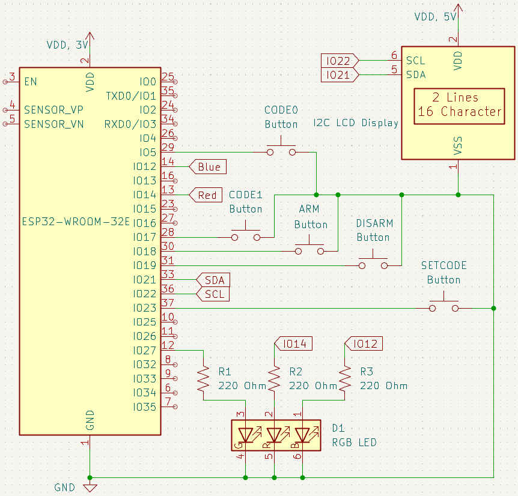

# BEEP WEEK 5 README
 
This week will be the final of our alarm system updates, this time focusing on an LCD Display and the method for controlling it: I2C!

  

---
## 5.1 Content Overview

### 5.1.1 Wired Serial Communication Protocols
Several of the peripherals included in the ESP32 package are dedicated to wired serial communication, including UART, SPI, I2C, and USB (which is vastly more complicated, if you're curious how it works take ECE 337). There are many more (such as CAN or FlexRAY), but these 4 are the most common. These protocols provide methods of sending and receiving data to and from off-chip peripherals such as sensors (lasers, gyroscopes, thermometers, etc.), I/O devices (keyboards, mice, etc.), motor controllers, displays, and more. They are called **Serial** because they send one bit at a time, as opposed to a typical parallel, on-chip bus fabric which may send a full byte at a time on 8 separate wires. Some important features to think about when comparing protocols are 

* Duplex Level: Whether the microcontroller and peripheral device(s) can send and receive data from each other at the same time or must wait their turn
* Speed: How many bits per second can be sent on a typical setup.
* Timing: Does the protocol have a **clock** line to tell each side of the bus when to measure bits.
* Multi-Connect Behavior: How many peripheral and master devices can be connected to the same bus.
* Hardware Driver: Can multiple devices initiate transactions, or must there be only one per line.

When thinking about serial protocols it is important to learn some terminology. Typically each set of wires is referred to as a **bus**, which has one or more **masters** (depending on the protocol and application), and one or more **subordinates** (depending on protocl and application). 
>Note that there are many terms for a bus peripheral including satellite, subordinate, or slave (which is being phased out in recent years, but still seen occasionally). 

Bus masters initiate transactions, whether it be sending to or requesting data from a subordinate. Subordinates respond to these requests, either by accepting the data sent to it or providing data when requested. Some protocols, like UART, are **point-to-point**. This means there are only two devices on the bus, directly connected together. 



Other protocols, like SPI, allow for a single master to talk to many subordinates.



The protocol we will be using today, I2C, allows many masters and many subordinates.



UART and SPI a
## 5.2 Walkthrough

### 5.2.1 Wiring



>Note: Connect the VCC pin on the LCD to the 5V pin on your ESP32, but do NOT connect anything else to the 5V pin. Also, if you have issues with the I2C lines try connecting a 2K Ohm pull-up resistor from SCL and SDA to the 3V power rail

### 5.2.2 Setup

Before you begin, please remember to create a new project:
1. Press ```ctrl+shift+p``` to open up the command panel
2. Look for ```ESP-IDF: Create New Empty Project```


3. Enter a folder name in the popup window


4. Select a location for the new folder (organize however you like!)

5. Replace the  ```main``` folder of your new project with the template main folder provided in this week's github folder.


### 5.2.3 Included Libraries
```C
#include "driver/gptimer.h"
#include "driver/gpio.h"
#include "driver/ledc.h"
#include "driver/i2c_master.h"
```
For peripheral structs and functions.

```C
#include "freertos/FreeRTOS.h"
#include "freertos/task.h"
#include "rom/ets_sys.h"
```
For FreeRTOS task support and delay function to prevent timeout.

```C
#include "esp_timer.h"
```
For getting current time, used to debounce buttons.  

```C 
#include "esp_log.h"
```
For logging messages to serial monitor.

### 5.2.4 (New) Global Variables

#### Constants
```C
#define I2C_SDA_PIN 21
#define I2C_SCL_PIN 22
```
Pin macros

```C
#define LCD_ADDR             0x27
#define FLAG_BACKLIGHT_ON    0x08
#define FLAG_ENABLE          0x04
#define FLAG_RS_DATA         0x01
#define FLAG_RS_COMMAND      0x00
```  
LCD_ADDR is the default I2C address for our LCD displays, and the rest are binary patterns for certain bit flags on the 1602 LCD, determined by the designers.

#### ISR Flags
```C
volatile bool first_code_press = false;
volatile bool second_code_press = false;
volatile bool code_button_pressed = false;
```
Splitting the code setting button flag into two, for more freedom when displaying on the screen in the main loop. We also add a combined flag for the code buttons so we can update the screen live on every button press.

#### I2C Bus Handles
```C
i2c_master_bus_handle_t bus_handle;
i2c_master_dev_handle_t lcd_handle;
``` 
Handles for the FreeRTOS I2C Bus Master configuration, used to send data over the selected I2C port; as well as the device that is connected to said port, which in our case is the LCD Display.

### 5.2.5 Coding

As seen in the schematic, we have added the LCD display this week! Most of the code provided is identical to what you've seen in previous weeks, with the exception of the setup & transaction code for said display. The new functions that you will be filling out are:
```C
static void lcd_send_cmd(uint8_t cmd)
static void lcd_send_char(uint8_t cmd)
void lcd_print(const char *str)
void setup_lcd()
```
As well as some print statements in the main loop, which we have given suggestions for but are totally up to you!

#### Function Descriptions

In `lcd_send_cmd` and `lcd_send_char` you need to fill in the buffer, which is just an array of 6 bytes, and send the command or character over the I2C bus. The array is 6 bytes long because of the interaction between the I2C chip on the back of the LCD and the LCD itself. The chip only uses 4 of the 8 D0-D7 bits for data (The other 4 are the flags you see macros defined for in helpers.h), which means we have to divide our writes into "nibbles" of 4 bits each. Both of these nibbles require a 3-step transmission process, where you send the data to let it settle, send it again with the enable flag toggled on, and then one final send. This pulses the enable flag and shifts the data you give it onto the display (This display is very odd, similar ones used in ECE 362 do not share this behavior, nor do many others you may come across).

In `lcd_print` you will use `lcd_send_char` to write a string to the display in the same way as printf("Hello World!") does to your terminal. The method we have chosen is a full line rewrite on every call, which means we need to clear whatever was there before. This function requires two while loops: the first to print as many characters as are present in the `str` argument, and the second to fill the rest of the line with whitespace, if any.  
String variables like `str` are functionally just arrays of characters, the same way the buffer in `lcd_send_cmd` is an array of integers, which means we can index specific items like `str[0]`, `str[1]`, etc. Also like other arrays, the variable name itself (be it `buffer` or `str`) stores the address of the first element. So dereferencing the pointer like `*str` is equivalent to `str[0]`. We can then increment the pointer itself like `str = str + 1` and then dereference it again to get `*str = str[1]`. You can keep doing this for the entire length of the string, stepping through one character at a time until you reach the last element, which for C strings declared like `"Hello World!"` is always a null terminator `\0`.  
This leads to an easy method for printing a string: print one character at a time with this pointer incrementing behavior until you detect that the character held at the pointers current location is the null terminator.

In `setup_lcd` you will need to fill in the bus and device config structs, and then call their respective initialization functions. The bus config and subsequent function call is a standard pattern across most embedded systems, but the device config is a software construct of the ESP-IDF and FreeRTOS. Both set internal registers on the ESP32 itself, with the device config changing the speed and i2c address for any transactions using the device's associated handle to abstract away those details from write or read calls. The rest of this function is the device specific initialization sequence for the LCD screen, which was found in an open-source github repo [here](https://github.com/DavidAntliff/esp32-i2c-lcd1602/blob/master/i2c-lcd1602.c).


## 5.4 Helpful Links

#### Documentation
* [ESP32 WROOM 32E Pinout](https://docs.sunfounder.com/projects/umsk/en/latest/07_appendix/esp32_wroom_32e.html)
* [ESP32 Technical Reference Manual](https://documentation.espressif.com/esp32_technical_reference_manual_en.pdf#iomuxgpio)
* [ESP-IDF Docs](https://docs.espressif.com/projects/esp-idf/en/stable/esp32/index.html)

#### Environment Setup
* [IDF Frontend (if you're curious)](https://docs.espressif.com/projects/esp-idf/en/stable/esp32/api-guides/tools/idf-py.html)
* [Dev Container Setup](https://docs.espressif.com/projects/vscode-esp-idf-extension/en/latest/additionalfeatures/docker-container.html)
* [WSL](https://learn.microsoft.com/en-us/windows/wsl/basic-commands)
* [USBIPD](https://github.com/dorssel/usbipd-win)