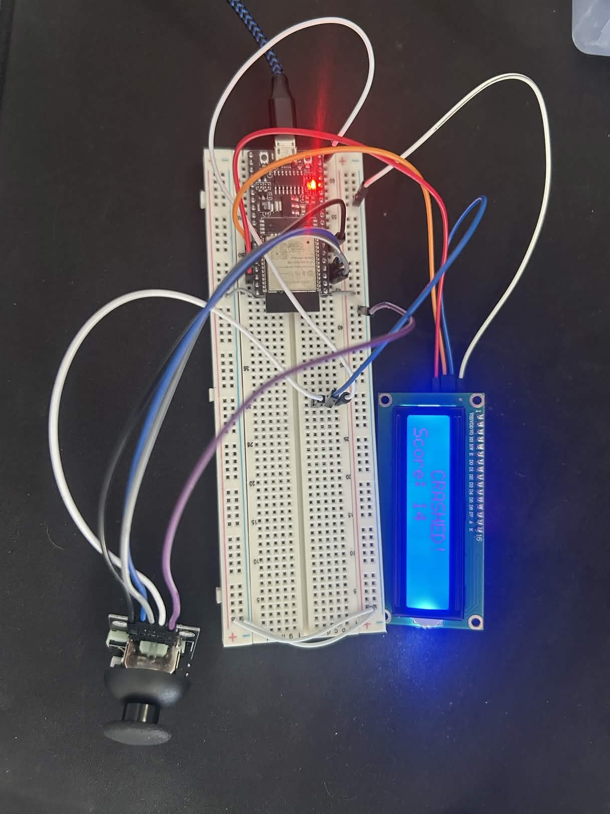
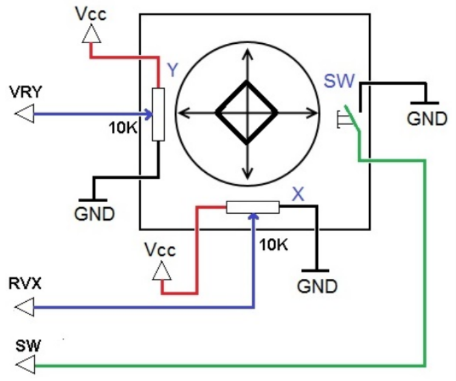
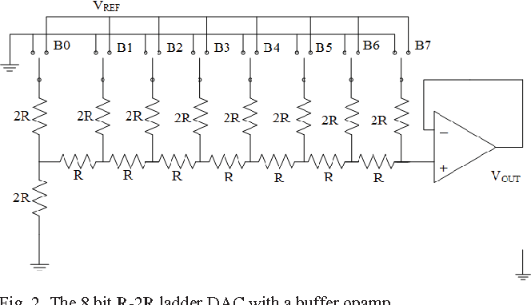
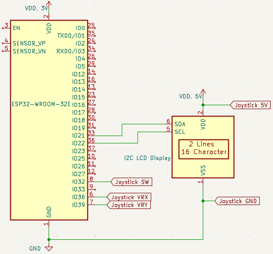
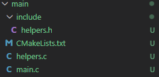

# BEEP WEEK 6 README
 
This week serves as an introduction to analog to digital conversions using an ADC (analog to digital converter) and DAC (digital to analog converter).

  

---
## 6.1 Content Overview

### 6.1.1 Potentiometers


**Potentiometers** (pots) are variable resistors used to convert physical position into an analog voltage. They consist of a resistive element with a sliding wiper that divides an input voltage (3.3V) into a variable output (0->3.3V). Similar to twsiting the potentiometer on the back of the LCD to control its brightness, turning the joystick moves the X and Y wipers on the joystick's internal potentiometers. These variable output voltages can then be read by the ESP32's **ADC**.

### 6.1.2 Analog->Digital Converters


A Successive Approximation Register (SAR) ADC converts analog voltages to digital values using a binary search. It iteratively compares the input voltage from the pin to a reference voltage via an internal DAC, setting bits from most significant to least significant until approximating the input. The flow looks like this: 
1. Read input voltage from the pin
2. Compare input to current reference voltage stored in the SAR, and output through the DAC.
3. If the input is larger, set the current guess bit to 1, if lower, set to 0.
4. Repeat for all 12 bits.

The ESP32 uses a 12-bit SAR ADC for precise sensor readings.

### 6.1.3 Digital->Analog Converters


An R-2R DAC (Resistor Ladder DAC) converts digital bits to analog voltages using a network of voltage dividers. Each bit switches between ground and a reference voltage, with an 8-bit version producing 256 (2^8) distinct voltage levels between 0 and VDD (3.3V). 

Each bit's contribution to the final voltage is precisely halved as you move down the ladder. For an 8-bit DAC, the final analog output is the weighted sum of these bits:$$V_{out} = V_{ref} \times \left(\frac{B_7}{2} + \frac{B_6}{4} + \frac{B_5}{8} + \dots + \frac{B_0}{256}\right)$$

## 6.2 Coding Activity

### 6.2.1 Circuit Setup



### 6.2.2 Environment Setup

Before you begin, please remember to create a new project:
1. Press ```ctrl+shift+p``` to open up the command panel
2. Look for ```ESP-IDF: Create New Empty Project```  


3. Enter a folder name in the popup window


4. Select a location for the new folder (organize however you like!)

5. Replace the ```main``` folder of your new project with the version provided in this week's github folder.  


6. Press `ctrl + shift + p` to open the VSCode command panel again, and run **Add VS Code Configuration Folder**.


### 6.2.3 Software

#### Headers

```C
#include "esp_adc/adc_oneshot.h"
```
For data structures and functions necessary to interface with the ADC peripheral.

#### Globals and Macros

```C
#define VRX_PIN 36
#define VRY_PIN 39
#define SW_PIN 32
#define LED_PIN 25
```
Pin macros.

```C
adc_oneshot_unit_handle_t adc1_handle;
```  
Handle for reading data from the ADC.

```C
char row_top[17] =    "                ";
char row_bottom[17] = "                ";
int ship_y = 0;
int score = 0;
bool game_over = false;
```
We use global variables to store the current game state: which is the two rows to be displayed on the screen, the ship's current row, the current score, and whether the game has ended or not.

#### Functions

* `setup_joystick` is responsible for setting up the ADC and its associated pins, necessary for reading the analog joystick input.

#### To Do

1. Fill in the missing lines in `setup_joystick`
2. Fill in the missing lines in `app_main`


## 6.3 Helpful Links

#### Documentation
* [ESP32 WROOM 32E Pinout](https://docs.sunfounder.com/projects/umsk/en/latest/07_appendix/esp32_wroom_32e.html)
* [ESP32 Technical Reference Manual](https://documentation.espressif.com/esp32_technical_reference_manual_en.pdf#iomuxgpio)
* [ESP-IDF Docs](https://docs.espressif.com/projects/esp-idf/en/stable/esp32/index.html)

#### Environment Setup
* [IDF Frontend (if you're curious)](https://docs.espressif.com/projects/esp-idf/en/stable/esp32/api-guides/tools/idf-py.html)
* [Dev Container Setup](https://docs.espressif.com/projects/vscode-esp-idf-extension/en/latest/additionalfeatures/docker-container.html)
* [WSL](https://learn.microsoft.com/en-us/windows/wsl/basic-commands)
* [USBIPD](https://github.com/dorssel/usbipd-win)