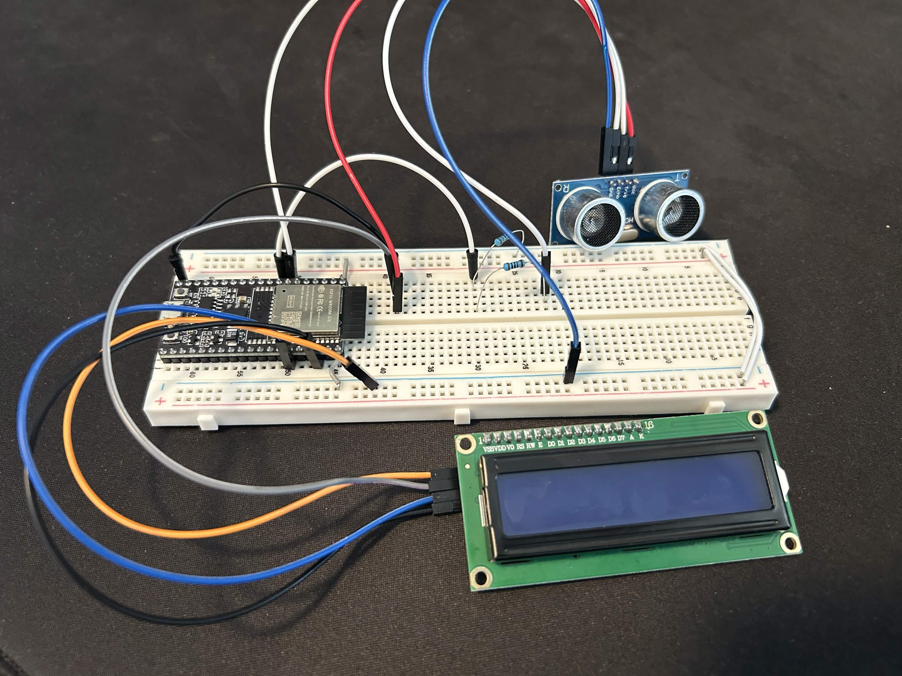
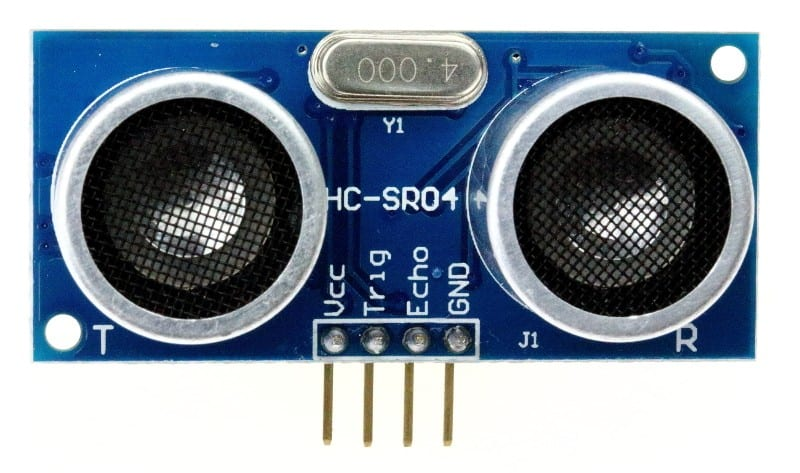
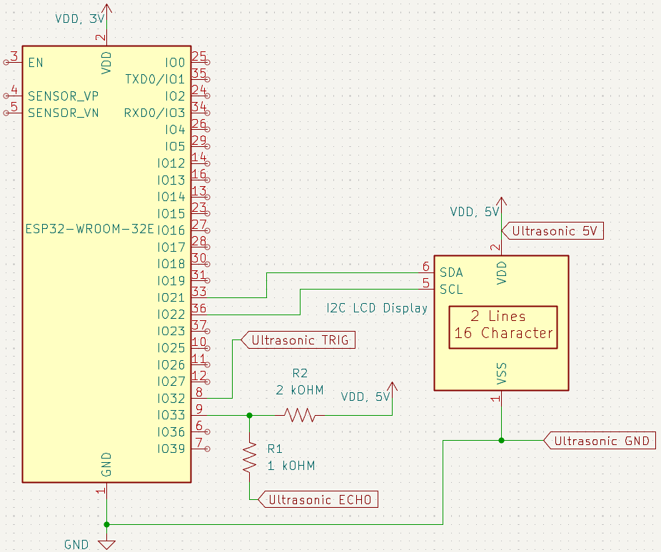

# Week 7 - RTOS Basics
 
This week 

  

---
## 7.1 Content Overview

### 7.1.1 Introduction
As you may have noticed in previous activities, we use `vTaskDelay` to wait between iterations of superloops in our programs. So far, these have functioned identically to `ets_delay_us` or any other sleep function, but this isn't their real purpose. They are a part of the **FreeRTOS** API, a **real-time operating system** that the ESP-IDF is based on.

FreeRTOS is not a full OS like windows, macOS, or linux, but it does provide some very important pieces, namely a **scheduler** and the ability to create **tasks**. This allows for simulated multithreading, just like your laptop may have hundreds of programs running simultaneously.

Each **task** can be thought of like an independent program (not 100% accurate, take ECE 469/437 if you're curious about processes vs. threads), which allows us to have multiple superlooping tasks running at once. Tasks do not have to run indefinitely though, there are plenty of cases where one would spawn a task (to handle an event, etc.) and then let it terminate. 

### 7.1.2 The Scheduler

If a processor core can only execute one instruction at a time, how do multiple tasks run simultaneously? The answer is **time slicing** and the **FreeRTOS Scheduler**.

Every millisecond (by default), a hardware timer triggers a **Tick Interrupt**. The scheduler wakes up, pauses the currently running task, looks at all the other tasks that want to run, and decides who gets the CPU next. Because this happens hundreds of times a second, it creates the illusion that your tasks are running in parallel.


### 7.1.3 Task States

To understand how the scheduler makes these decisions, you need to understand the three basic states a task can be in:

* **Running**: The task currently owns the CPU and is executing code.

* **Ready**: The task is ready to run, but the CPU is currently busy executing a different task.

* **Blocked** (Sleeping): The task cannot run right now because it is waiting for something (like a timer to expire or a message to arrive).

This is where the difference between `ets_delay_us()` and `vTaskDelay()` becomes critical. If you use a function like `ets_delay_us()`, your task remains in the **Running** state. This wastes any time left before the next tick interrupt lets the scheduler swap it out. When you call `vTaskDelay()`, you are actively yielding the CPU. This tells the scheduler to place the delaying function in the **Blocked** state immediately and give the CPU to another task.

### 7.1.4 Task Priority

If multiple tasks are in the **Ready** state at the same time, the scheduler needs a method to determine who gets the CPU first, this is called **priority**. When you create a task using `xTaskCreate()`, you assign it a priority number (in FreeRTOS, higher numbers = higher priority). The rule is very simple, if there are multiple ready tasks the higher priority task always gets the CPU first.

### 7.1.5 Queues: Event-Driven Task Waking
Many tasks (like the ones you'll be writing today!) need to respond to events such as new sensor data.

Instead of writing a task that constantly wakes up to check if new data is available, FreeRTOS provides **Queues**. A queue is a thread-safe mailbox used to pass data between tasks. The important states of a task on the receiving end of a queue are:

* **Blocking**: A receiving task can attempt to read from an empty queue which tells the scheduler to wait indefinitely (portMAX_DELAY). The scheduler moves this task to the Blocked state. It consumes zero CPU cycles while waiting.

* **Waking Up**: Another task or ISR generates data and sends it to the queue.

* **Preemption**: The moment the data enters the queue, the scheduler instantly moves the receiving task from **Blocked** to **Ready**. If the receiving task has a higher priority than the task that just sent the data, the scheduler will immediately pause the current task and hand the CPU to the receiving task so it can process the new data.

### 7.1.6 Ultrasonic Sensors



The **HC-SR04** ultrasonic sensor measures the distance to whatever object you point it at, up to ~4m away. It does this by bouncing sound waves off of the object and measuring how long they take to bounce back. One of the little "speakers" emits a sound wave and the other measures it's reflection. 

Each measurement is triggered by the microcontroller, which needs to pulse the **TRIG** pin high and then low. When triggered, the sensor sets the **ECHO** pin high, takes the measurement, and then sets **ECHO** low. By taking timestamps when **ECHO** goes high and low (on the microcontroller) we can roughly calculate the measured distance! You may notice tht the circuit diagram has two resistors connected to the **ECHO** pin as well. These form a **voltage divider** (we won't get into this today, if you've taken ECE 2K1 you'll remember this) to step the HC-SR04s 5V logic down to the 3V necessary for the ESP32.


## 7.2 Coding Activity

### 7.2.1 Circuit Setup



### 7.2.2 Environment Setup

Before you begin, please remember to create a new project:
1. Press ```ctrl+shift+p``` to open up the command panel
2. Look for ```ESP-IDF: Create New Empty Project```  


3. Enter a folder name in the popup window


4. Select a location for the new folder (organize however you like!)

5. Replace the ```main``` folder of your new project with the version provided in this week's github folder.  


6. Press `ctrl + shift + p` to open the VSCode command panel again, and run **Add VS Code Configuration Folder**.


### 7.2.3 Software

#### Headers

No new header files this week!

#### Globals and Macros

```C
#define TRIG_PIN 32
#define ECHO_PIN 33
```
Pin macros for the ultrasonic sensor.

```C
QueueHandle_t distance_queue;
```
Queue struct for storing the ultrasonic distance values that are printed out by the lcd_printer task.

#### Functions

* `setup_ultrasonic` is responsible for setting up the associated gpio pins necessary to interface with the ultrasonic sensor.

* `ultrasonic_task` is a FreeRTOS task that gathers distance data from the ultrasonic sensor and pushes it into a queue for the printer task to consume.

* `lcd_display_task` is a FreeRTOS task that pops distance data off of the queue and updates the LCD screen accordingly.

#### To Do

1. Fill in the missing lines in `setup_ultrasonic`
2. Fill in the missing lines in `ultrasonic_task`
3. Fill in the missing lines in `lcd_display_task`
4. Fill in the missing lines in `app_main`

## 7.3 Helpful Links

#### Documentation
* [ESP32 WROOM 32E Pinout](https://docs.sunfounder.com/projects/umsk/en/latest/07_appendix/esp32_wroom_32e.html)
* [ESP32 Technical Reference Manual](https://documentation.espressif.com/esp32_technical_reference_manual_en.pdf#iomuxgpio)
* [ESP-IDF Docs](https://docs.espressif.com/projects/esp-idf/en/stable/esp32/index.html)

#### Environment Setup
* [IDF Frontend (if you're curious)](https://docs.espressif.com/projects/esp-idf/en/stable/esp32/api-guides/tools/idf-py.html)
* [Dev Container Setup](https://docs.espressif.com/projects/vscode-esp-idf-extension/en/latest/additionalfeatures/docker-container.html)
* [WSL](https://learn.microsoft.com/en-us/windows/wsl/basic-commands)
* [USBIPD](https://github.com/dorssel/usbipd-win)